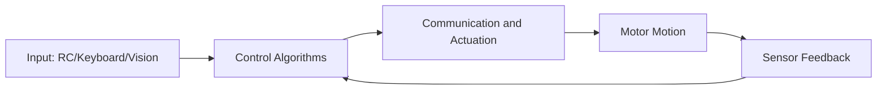

# 00 Preface

## Preface

RoboMaster is a highly engineering-driven competition. Electrical control, vision, algorithms, communication, and debugging workflows must all work together, which makes the stack broad and the learning curve steep.

At NYU Shanghai, where core engineering coursework is relatively limited, mastering every control topic at once is unrealistic. This guide is designed to reduce onboarding cost: first run a minimum control loop, then gradually build complete embedded engineering capability.

This document was first written when the team was still in an early stage. Technical accumulation was limited and trial-and-error samples were still few, so some parts may be imperfect. Please keep improving it as a living team knowledge base.

## Technical Stack

Baseline assumption: you already have fundamental computing skills (including ICP/ICDS-related foundations) and the following general knowledge.

- Git
- basic Linux operations (Ubuntu)
- conceptual fluency in at least one programming language

### Core knowledge for electrical control

- embedded development
- C language and compilation
- microcontrollers (MCUs)
- basic control algorithms

In our curriculum, `Computer Architecture` and `Operating System` provide C, compilation, and interrupt foundations used directly in control work. `Embedded System` is even closer to daily electrical-control practice. Data structures from `Data Structure` are also used repeatedly. Hardware-facing work additionally requires basic `Circuit` knowledge.

### Core knowledge for vision

- traditional computer vision
- neural networks (YOLO)
- camera intrinsics, extrinsics, and calibration
- vision-related physical principles

At NYU Shanghai, `Computer Vision` can serve as the theoretical base, while team vision development extends it into engineering practice.

### Core knowledge for Sentry

- SLAM
- radar-based localization algorithms
- navigation algorithms

There is no fully matching internal course yet, but Tandon's `Localization and Robotics Navigation` covers related topics.

## Why These Skills Still Matter

In an era dominated by machine learning and NLP, traditional electrical control and vision may appear less trendy. However, the engineering methods built here are highly transferable and repeatedly useful in later projects. If you are interested in robotics systems, the control stack provides a complete and practical training ground.

## General Essentials

- correct power-on/power-off procedure
- function of each hardware module
- basic safety rules

## Electrical Control Overview

The core objective is simple: convert keyboard/remote inputs into motor current outputs so the robot behaves as intended.

Typical implementation work includes:

- building stable speed loops from motor feedback
- using IMU data for forward/inverse kinematic solving
- delivering low-level MCU implementation, including CAN communication and STM32CubeMX configuration

In short, electrical control is about achieving predictable and repeatable robot motion in a complex system.

## Understanding Hardware

Control onboarding starts from hardware. You do not need full analog/digital circuit specialization at the beginning, but you must be able to:

- explain the role of each key component
- complete basic wiring and troubleshooting
- configure and manage CAN IDs correctly

## Git and Environment

- for detailed Git setup, see: [/en/robomaster/git-env](/en/robomaster/git-env)
- recommended setup: AI toolchain + VS Code

## Chapter Diagram

