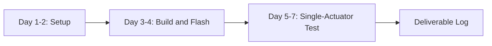

# 01 Getting Started

## Chapter Goal

After this chapter, you should be able to answer:

1. what the RoboMaster controls team actually does
2. what the minimum week-1 deliverable is
3. why small experiments come before full-system modification

## 1. What Controls Work Really Is

Controls is not "write code and make motors spin." In real projects you must:

- convert input (remote / keyboard-mouse / vision) into stable targets
- send targets through communication layers
- read feedback and correct error continuously
- keep system controllable, stoppable, and recoverable under faults

In one sentence: **build a predictable system, not a sometimes-working system.**

## 2. Minimum Deliverable for New Members

A common onboarding failure is learning concepts without producing runnable output.

Set your first objective as:

- build succeeds locally
- one successful flash
- one actuator responds reproducibly to commands

If you can do these three, you are already a usable contributor.

## 3. Why Sequence Matters

Typical failure path:

- read large code blocks first and try to understand everything at once
- change parameters without logs
- change many variables together and lose causality

Recommended path:

- minimum loop first (build -> flash -> single-module response)
- architecture understanding second (tasks, messaging, communication)
- performance optimization last (frequency, tuning, integration)

## 4. Week-1 Action Checklist

### Day 1-2

- finish toolchain setup
- clone repository and build successfully

### Day 3-4

- bring up one flashing path (DFU or debugger)
- confirm startup behavior is observable

### Day 5-7

- run one single-actuator observable experiment
- write one short experiment log (goal, action, result, issue)

## 5. Vocabulary Preview

- `BSP`: hardware abstraction layer wrappers
- `Module`: reusable functional unit (motor, algorithm, messaging)
- `Application`: robot-level business logic
- `Closed Loop`: feedback-driven correction process
- `CAN`: common bus for controls transport

You only need rough understanding now; details appear in later chapters.

## 6. Pass Criteria

You pass this chapter if:

- you can explain control-team boundaries to a teammate
- you know exactly what to deliver in week 1
- you accept the "small-first" engineering rhythm

## 7. Common Misconceptions

- misconception 1: understand all code before touching hardware
- misconception 2: optimize performance before baseline stability
- misconception 3: debug from memory without written logs

These three reduce onboarding speed sharply.

## Chapter Diagram

