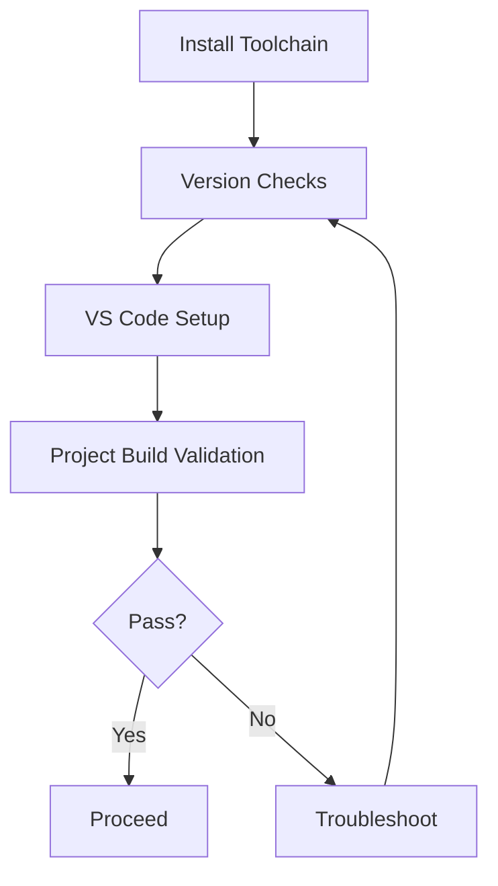

# 02 Tools and Environment

## Chapter Goal

Based on the practical workflow used in `nyush-rm-control`, build a setup that works on day one:

- build-ready
- flash-ready
- debug-ready
- collaboration-ready

This chapter does not try to install everything at once. The priority is a working minimum loop.

## 1. Toolchain Map (Understand Before Installing)

Core tools and roles:

- `git`: version control and collaboration
- `arm-none-eabi-gcc`: STM32 cross-compiler
- `make` / `mingw32-make`: build entry point
- `openocd`: debugger bridge (ST-Link / DAP-Link)
- `dfu-util`: USB DFU flashing path
- `VS Code`: editing, task integration, breakpoint debugging

Common helper tools:

- `STM32CubeProgrammer`: GUI flashing (more beginner-friendly)
- `STM32CubeMX`: peripheral initialization and code generation

## 2. Platform Setup (Aligned with nyush-rm-control)

### macOS

```bash
xcode-select --install
brew install --cask gcc-arm-embedded
brew install openocd dfu-util
```

### Windows (MSYS2 recommended)

Run in `MSYS2 MSYS` terminal:

```bash
pacman -Syu
# If prompted to restart terminal, reopen and run again
pacman -Syu

pacman -S mingw-w64-x86_64-toolchain \
          mingw-w64-x86_64-arm-none-eabi-toolchain \
          mingw-w64-x86_64-openocd \
          mingw-w64-x86_64-dfu-util \
          git
```

Then add `C:\msys64\mingw64\bin` to system `Path`, and restart terminal or VS Code.

### Linux (Ubuntu/Debian)

```bash
sudo apt update
sudo apt install gcc-arm-none-eabi openocd dfu-util build-essential git
```

## 3. Minimum Post-Install Validation

Run in order:

```bash
git --version
arm-none-eabi-gcc --version
openocd --version
dfu-util --version
```

Pass condition: every command prints a version, not `command not found`.

## 4. VS Code Minimum Setup

Recommended extensions:

- `C/C++`
- `Cortex-Debug`
- `Cortex-Debug: Device Support Pack - STM32F4`
- `Makefile Tools`

Suggested workspace settings (`.vscode/settings.json`):

```json
{
  "files.eol": "\n",
  "editor.formatOnSave": true,
  "C_Cpp.default.configurationProvider": "ms-vscode.makefile-tools",
  "makefile.configureOnOpen": false
}
```

Additional Windows settings:

```json
{
  "makefile.makePath.windows": "mingw32-make",
  "cortex-debug.armToolchainPath.windows": "C:\\msys64\\mingw64\\bin",
  "cortex-debug.openocdPath.windows": "C:\\msys64\\mingw64\\bin\\openocd.exe"
}
```

## 5. Project-Level Validation (Required)

In project root, run:

```bash
make ROBOT_TYPE=infantry -j12
```

Validation points:

- build completes without fatal errors
- `build/` artifacts are generated (such as `.elf`, `.bin`)

If this fails, do not debug business logic first. Fix environment issues first.

## 6. Common Issues and Troubleshooting Order

Recommended order:

1. check `PATH` coverage for required tools
2. check version conflicts (multiple `gcc/openocd/make`)
3. check terminal context (`cmd`, PowerShell, or MSYS2 on Windows)
4. check whether VS Code is loading the intended workspace settings

High-frequency issues:

- `make` not found on Windows: use `mingw32-make`
- `dfu-util -l` finds no device: confirm board is in DFU mode
- `openocd` launch failure: check debugger driver and interface config first

## 7. Chapter Tasks

- Task A: run all version checks and save output
- Task B: complete one `make ROBOT_TYPE=infantry -j12`
- Task C: write a 5-10 line troubleshooting note (symptom, cause, action, result)

## 8. Pass Criteria

- you can reproduce the same setup on a fresh machine
- you can decide when to debug environment vs code
- you can guide a newcomer from installation to first successful build

## Chapter Diagram



