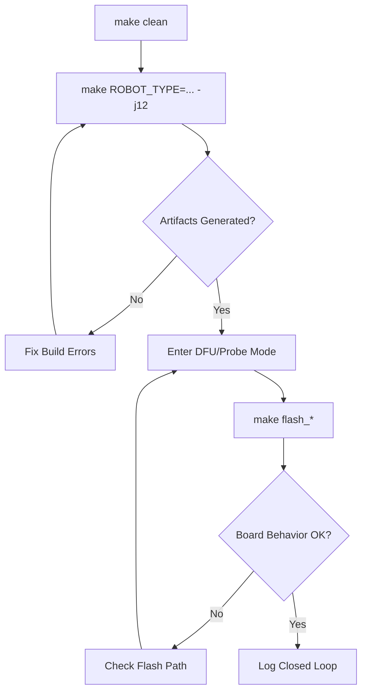

# 03 First Build and Flash

## Chapter Goal

Turn repository source code into running firmware on hardware, and complete your first reproducible build-and-flash loop.

By the end of this chapter, you should be able to:

- complete a full build independently
- flash successfully with at least one method
- decide whether a failure is in build stage or flash stage

## 1. Pre-Flight Checklist

Confirm all conditions first:

- toolchain checks from Chapter 02 pass (`gcc/openocd/dfu-util/make` available)
- board power is stable and USB cable supports data (not charge-only)
- target robot type is known (default is `infantry`)

## 2. Build Chain and Artifacts

Minimum chain:

```text
source -> preprocess/compile -> link -> artifacts -> flash -> board startup
```

Common artifacts:

- `.elf`: best for debugging and symbols
- `.hex`: text-format firmware image
- `.bin`: raw binary image (commonly used by DFU)

## 3. First Build (Recommended Order)

### Step A: Clean old artifacts

```bash
make clean
```

### Step B: Build in parallel

```bash
make ROBOT_TYPE=infantry -j12
```

You can switch robot type when needed:

```bash
make ROBOT_TYPE=hero -j12
make ROBOT_TYPE=sentry -j12
```

Note: in `nyush-rm-control`, `ROBOT_TYPE` defaults to `infantry`. Use that if uncertain.

### Step C: Verify build outputs

Check that `build/` contains artifacts (such as `.elf`, `.bin`). If no artifacts exist, fix build errors before flashing.

## 4. First Flash (DFU First)

In `nyush-rm-control`, the default flash target is `flash_dfu`. This is the recommended first path.

### Step A: Enter DFU mode on board

Follow hardware instructions for BOOT0 and RST.

### Step B: Confirm DFU device detection

```bash
dfu-util -l
```

If you see STM32 DFU device info such as `0483:df11`, the link is ready.

### Step C: Flash firmware

```bash
make flash_dfu
# or the default target
make flash
```

### Step D: Exit DFU and reboot

Press RST once (or power-cycle) and verify firmware behavior.

## 5. Other Flash Paths (When Debug Probe Is Available)

If an external debugger is connected, use:

```bash
make flash_dap
make flash_stlink
make flash_jlink
```

Selection rule:

- DAP-Link connected: `flash_dap`
- ST-Link connected: `flash_stlink`
- J-Link connected: `flash_jlink`

## 6. How to Confirm Success

At least two checks should pass:

- command exits without errors
- board restart shows expected state change (LED/log/behavior)
- test input triggers actuator response

## 7. Common Failures and Debug Path

Frequent issues:

- `command not found`: environment issue, return to Chapter 02
- no build artifacts: build-stage failure, do not flash yet
- `dfu-util -l` shows no device: DFU mode or USB path issue
- `openocd` connection failure: debugger driver/config mismatch

Recommended debug order:

1. confirm tools are executable
2. confirm artifacts exist
3. confirm download path (DFU or probe)
4. then inspect application logic

## 8. Failure Log Template (Recommended)

```text
Target command:
Symptom:
Checked items:
Action taken:
Result:
```

## 9. Chapter Tasks

- Task A: run `make clean && make ROBOT_TYPE=infantry -j12`
- Task B: complete one `make flash_dfu` (or another available method)
- Task C: submit one failure log (or a "zero-failure" record)

## 10. Pass Criteria

- you can complete build and flash independently
- you can clearly distinguish build errors from flash errors
- you can guide a newcomer through first successful deployment

## Chapter Diagram



