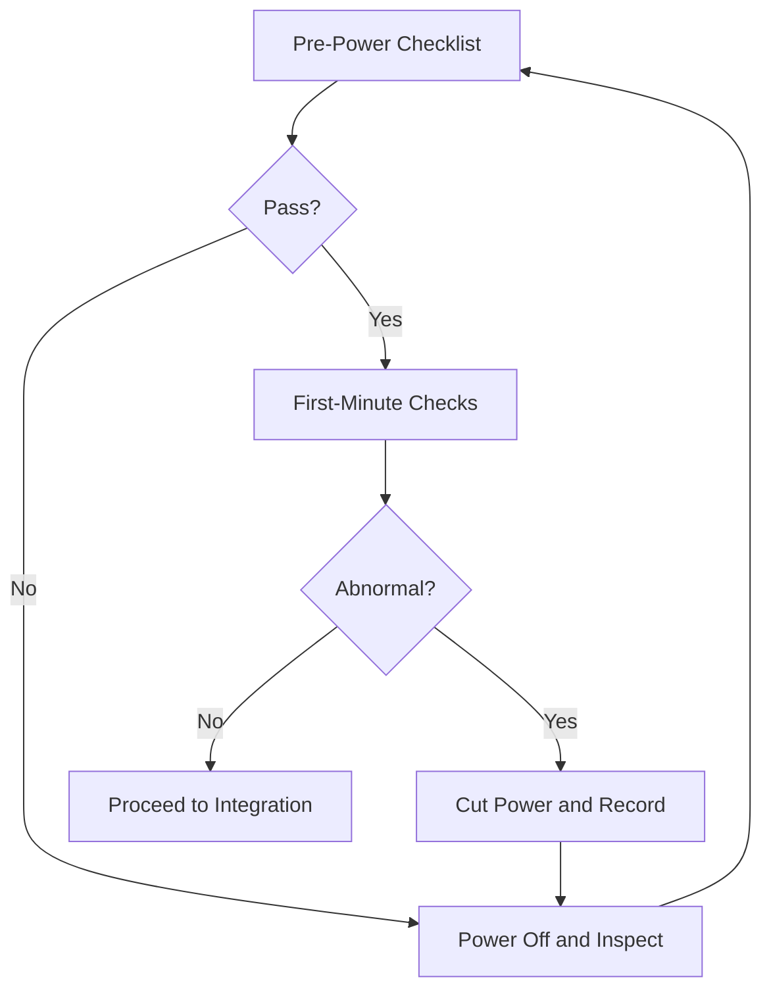

# 04 Hardware and Safety Basics

## Chapter Goal

Build minimum hardware awareness and safe operating boundaries, so you do not spend days debugging software for what is actually a wiring issue.

By the end of this chapter, you should be able to:

- explain the roles of controller, ESC, motor, power, and CAN
- run a complete pre-power safety check independently
- make an initial hardware-first vs software-first diagnosis within 5 minutes

## 1. Build a System View First

Treat the electrical-control system as five chains:

- control chain: controller board runs tasks and control logic
- actuation chain: ESC converts control outputs into motor drive
- sensing chain: encoder/IMU/limit feedback returns to controller
- communication chain: CAN/UART carries commands and status
- power chain: battery/distribution/protection determines stability

Any one of these chains failing can look like "robot not moving" or "robot moving unexpectedly."

## 2. Typical Hardware Combinations (Training First)

- common chassis pair: `M3508 + C620`
- light-load mechanism: `M2006 + C610`
- common gimbal motor: `GM6020`
- controller: RoboMaster Development Board Type C (STM32F4 family)

For detailed parameters, use:

- [/en/robomaster/hardware-overview](/en/robomaster/hardware-overview)
- [/en/robomaster/hardware-manuals](/en/robomaster/hardware-manuals)

## 3. Safety Red Lines (Non-Negotiable)

- never skip pre-power checks
- never continue high-current tests with known hardware faults
- never increase speed/current when risk boundaries are unclear
- never connect motor/ESC directly to the controller board XT30 port (back-EMF damage risk)

If you are unsure whether the current state is safe, power off first.

## 4. Pre-Power Checklist (Item by Item)

1. power polarity is correct and voltage is in allowed range
2. `CAN_H/CAN_L` is not swapped and connectors are stable
3. motor/ESC/CAN IDs are conflict-free
4. connectors are fully seated and cable insulation is intact
5. mechanism moves freely without obvious jamming
6. emergency-stop strategy is clear (who cuts power, who observes)

Recommendation: for first power-up, keep wheels off ground or disconnect high-risk actuators for no-load verification.

## 5. First-Minute Post-Power Checks (Fast Loss Prevention)

- board status LED pattern is expected
- motors do not spin under no-command condition
- no abnormal heat, smell, or noise
- logs show no persistent offline/bus/error spikes

If abnormal: power off immediately -> record with photo/video -> then troubleshoot. Do not continue testing while fault is active.

## 6. High-Frequency Misdiagnoses for New Members

- bad grounding looks like random software bugs
- loose connectors look like unstable scheduling/logic
- mechanical resistance changes look like PID regression
- CAN ID conflicts look like intermittent packet loss

Rule: check power/wiring/ID/mechanics before touching control logic.

## 7. Quick Layered Troubleshooting Method

Use this order:

1. power stability
2. wiring correctness
3. ID conflicts
4. bus connectivity
5. then software logs and control parameters

If the first four are not clean, do not tune algorithms yet.

## 8. Chapter Tasks

- Task A: list current hardware inventory (controller/ESC/motor/sensor/power)
- Task B: for each component, write one "failure symptom -> first check"
- Task C: complete a two-person cross-check power-up inspection with sign-off

## 9. Pass Criteria

- you can execute safe power-up independently
- you can separate hardware-layer and software-layer issues early
- you can turn the process into a reusable team checklist

## Chapter Diagram

