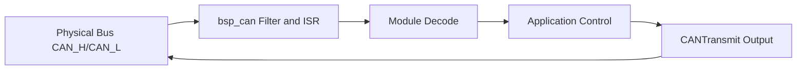

# 05 CAN Basics

## Chapter Goal

This chapter moves from "usable" to "code-level understanding":

- you can explain the full CAN data path in this project
- you can build an ID plan from code, not only from manuals
- you can localize CAN faults by layer with a fixed workflow

## 1. Build a Three-Layer Mental Model

In `nyush-rm-control`, CAN can be understood in three layers:

- `bsp` layer: `bsp/can/bsp_can.c` handles registration, filters, TX/RX dispatch
- `module` layer: e.g. `modules/motor/DJImotor/dji_motor.c`, `modules/super_cap/super_cap.c` handles protocol decoding
- `application` layer: e.g. `application/chassis/chassis.c`, `application/cmd/robot_cmd.c` handles control logic and inter-board transport

Diagnose by layer first. It is much faster.

## 2. CAN Hardware Configuration in Code

`Src/can.c` configures CAN1/CAN2 with the same parameters:

- `Prescaler = 3`
- `BS1 = 10TQ`
- `BS2 = 3TQ`
- `AutoRetransmission = ENABLE`
- `TransmitFifoPriority = ENABLE`

With the clock setup in `Src/main.c` (APB1 = 42MHz), this gives about `1 Mbps`, aligned with common RoboMaster motor/ESC settings.

## 3. How `bsp_can` Actually Works

### 3.1 Registration Stage

`CANRegister()` performs key actions:

- on first registration, starts CAN1/CAN2 and enables FIFO0/FIFO1 notifications
- allocates one filter per instance (accepts configured `rx_id` only)
- sets default TX `DLC=8`
- stores callback pointer for per-module parsing

Current capacity: `CAN_MX_REGISTER_CNT = 16` (`bsp/can/bsp_can.h`).

### 3.2 Filter and Interrupt Dispatch

Implementation details (`CANAddFilter` + `CANFIFOxCallback`):

- filter banks `0-13` for CAN1, `14-27` for CAN2
- filter mode is `IDLIST`
- RX dispatch matches by `can_handle + rx_id`, then invokes module callback

So if your `rx_id` plan is correct, decoding stays straightforward.

### 3.3 Transmission Stage

`CANTransmit()` waits for a free mailbox, then calls `HAL_CAN_AddTxMessage`.

- if mailbox stays full past timeout, TX fails and logs warning
- timeout should not exceed task period, otherwise real-time tasks may be delayed

## 4. DJI Motor Mapping in This Codebase

Core file: `modules/motor/DJImotor/dji_motor.c`

### 4.1 Common Confusion

In motor init, `can_init_config.tx_id` means motor logical ID (DIP/setup ID), not final CAN frame ID.

### 4.2 What the Framework Auto-Generates

`MotorSenderGrouping()` automatically:

- computes feedback `rx_id`
  - M2006/M3508: `0x200 + id`
  - GM6020: `0x204 + id`
- assigns sender group (4 motors per frame)
- chooses frame ID: `0x1FF` / `0x200` / `0x2FF`

Internally, six sender slots are prebuilt (3 groups on CAN1 + 3 on CAN2), and `DJIMotorControl()` sends them in batch.

### 4.3 ID Collision Protection

During registration, same-bus `rx_id` collisions are checked and treated as fatal errors.

So adjust IDs in config headers first, not by ad-hoc edits in application logic.

## 5. Inter-Board `CANComm`: Beyond 8 Bytes

Core file: `modules/can_comm/can_comm.c`

`CANComm` adds packetization on top of CAN 8-byte frames:

- frame format: `'s' + len + data + crc8 + 'e'`
- max payload: `60` bytes (`CAN_COMM_MAX_BUFFSIZE`)
- sender slices data into 8-byte chunks, adjusts DLC for the final chunk
- receiver reassembles by state machine and validates `crc8`

### 5.1 Real Usage in Application

Chassis board and gimbal board communication example:

- `application/chassis/chassis.c`: `tx_id=0x311, rx_id=0x312`
- `application/cmd/robot_cmd.c`: `tx_id=0x312, rx_id=0x311`

Payload lengths are:

- `sizeof(Chassis_Ctrl_Cmd_s)`
- `sizeof(Chassis_Upload_Data_s)`

These structs are defined under `#pragma pack(1)` in `application/robot_def.h`, preventing alignment mismatch across boards.

### 5.2 Online Detection Recommendation

`CANComm` uses `Daemon` for online checks. Set `daemon_count` explicitly in `CANComm_Init_Config_s` based on your `DaemonTask` period and desired timeout window.

## 6. Where Your ID Plan Should Be Maintained

Keep ID definitions centralized in:

- robot config and IDs: `application/robot_configs/robot_infantry.h` (and hero/sentry variants)
- CANComm endpoints: `application/chassis/chassis.c`, `application/cmd/robot_cmd.c`
- module-level ID mapping logic: `modules/motor/DJImotor/dji_motor.c`

Do not scatter IDs across temporary code edits.

## 7. Bus Load and Control Frequency (Must Be Budgeted)

Known facts:

- motor control task `StartMOTORTASK` runs at about 1kHz (`osDelay(1)`)
- `dji_motor.h` explicitly warns that too many high-frequency devices on one bus can congest CAN

Engineering guidance:

- keep high-frequency devices per bus limited (training-stage recommendation: no more than ~6)
- if you see frame loss or jitter, reduce feedback/TX frequency before retuning PID
- use CAN1/CAN2 load balancing instead of placing all high-rate devices on one bus

## 8. Fixed Troubleshooting Order (Code-Aligned)

1. physical layer: power, wiring, termination
2. peripheral layer: after `dfu/openocd` is healthy, verify devices are actually online
3. BSP layer: confirm `CANRegister` path and `rx_id` mapping
4. module layer: confirm callback trigger and decode alignment
5. app layer: confirm CANComm `tx/rx` symmetry and matching struct sizes

Rule: do not move to next layer before current layer is clean.

## 9. Chapter Tasks

- Task A: draw your current CAN topology (CAN1/CAN2, IDs, termination positions)
- Task B: trace one motor feedback path in code: interrupt -> callback -> data struct
- Task C: complete one inter-board communication bug report (symptom, layer, root cause, fix)

## 10. Pass Criteria

- you can explain the full path from CAN wire to application variable
- you can produce and apply a conflict-free ID plan in config files
- you can narrow a CAN issue to a specific layer within 10 minutes

## Chapter Diagram

