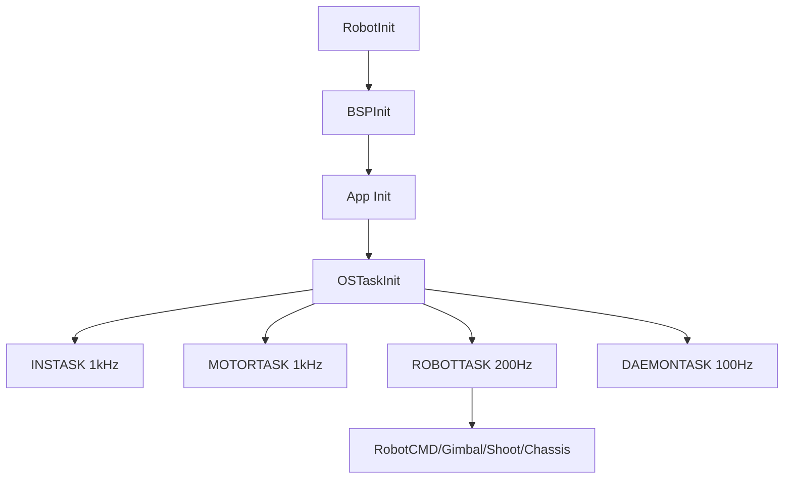

# 06 Architecture and Task Flow

## Chapter Goal

Map folder structure to runtime behavior. After this chapter, you should be able to answer:

- which task executes this control path
- which layers this data passes through
- which modules are affected by one config change

## 1. Start at Build Time: How Robot Type Is Selected

In `nyush-rm-control/Makefile`, the default is:

- `ROBOT_TYPE ?= infantry`

Then `application/robot_config_select.h` maps `ROBOT_TYPE_*` to:

- `robot_infantry.h`
- `robot_hero.h`
- `robot_sentry.h`

This selection defines board mode (`ONE_BOARD/CHASSIS_BOARD/GIMBAL_BOARD`), CAN assignment, IDs, and control parameters.

## 2. Then Initialization: How the System Boots

Core entry is `RobotInit()` in `application/robot.c`:

1. disable interrupts
2. run `BSPInit()`
3. run `LEDInit()`
4. initialize app modules by board mode: `RobotCMDInit/GimbalInit/ShootInit/ChassisInit`
5. run `OSTaskInit()` to create tasks
6. re-enable interrupts

This is why the docs keep saying: do not rely on normal interrupt-based delays during init.

## 3. Runtime Task Map: Who Runs at What Rate

Tasks are created in `application/robot_task.h`. Key periods:

- `INSTASK`: `osDelay(1)` (~1kHz)
- `MOTORTASK`: `osDelay(1)` (~1kHz)
- `ROBOTTASK`: `osDelay(5)` (~200Hz)
- `DAEMONTASK`: `osDelay(10)` (~100Hz)
- `MONITORTASK`: `osDelay(20)` (~50Hz)
- `UITASK`: continuous loop with internal throttling

Main business path is in `RobotTask()`:

- gimbal side: `RobotCMDTask -> GimbalTask -> ShootTask`
- chassis side: `ChassisTask`

## 4. Real Layer Mapping in Code

### BSP Layer (hardware abstraction)

- example: `bsp/can/bsp_can.c`
- responsibility: CAN registration, filters, ISR dispatch, TX API

### Modules Layer (reusable capabilities)

- example: `modules/motor/DJImotor/dji_motor.c`
- example: `modules/can_comm/can_comm.c`
- example: `modules/message_center/message_center.c`
- responsibility: protocol parsing, control calculation, cross-app messaging

### Application Layer (robot behavior)

- example: `application/cmd/robot_cmd.c`
- example: `application/chassis/chassis.c`
- responsibility: mode switching, kinematics, orchestration

## 5. Single-Board vs Dual-Board Data Paths

### Single-board (`ONE_BOARD`)

Cross-app data uses `message_center` pub-sub:

- `robot_cmd` publishes `chassis_cmd/gimbal_cmd/shoot_cmd`
- other apps subscribe and consume

Important detail: `QUEUE_SIZE = 1` in `modules/message_center/message_center.h`, so this is "latest-value" semantics, not full history.

### Dual-board (`CHASSIS_BOARD/GIMBAL_BOARD`)

Inter-board data uses `CANComm`:

- chassis board (`application/chassis/chassis.c`): `tx_id=0x311, rx_id=0x312`
- gimbal board (`application/cmd/robot_cmd.c`): `tx_id=0x312, rx_id=0x311`

Payload length is bound by `sizeof(...)`, and transport structs are packed with `#pragma pack(1)` in `application/robot_def.h` to avoid alignment mismatch.

## 6. One Full Control Chain (Code-Aligned)

Example: chassis velocity command path

1. `RobotCMDTask()` generates `Chassis_Ctrl_Cmd_s`
2. single-board: publish via `message_center`; dual-board: send via `CANCommSend()`
3. `ChassisTask()` fetches command and runs kinematic solve
4. calls `DJIMotorSetRef()`
5. `DJIMotorControl()` in `MOTORTASK` computes PID and packs grouped frames
6. `CANTransmit()` sends to ESC/motors
7. motor feedback is decoded in CAN callback and updates measurement state

If it breaks, localize by this chain layer-by-layer.

## 7. Online Monitoring and Fault Boundary

`Daemon` (`modules/daemon`) provides online detection:

- `DaemonReload()` on fresh data
- timeout triggers offline callback (for example motor offline warning)

Use it as a safety boundary, not as a replacement for structured debugging.

## 8. Where to Place Changes

- robot parameters and IDs: `application/robot_configs/*.h`
- communication protocol: `modules/can_comm` or related module
- business logic: `application/*`
- do not place business logic into `bsp`

## 9. Chapter Tasks

- Task A: draw task and data flow for your current mode (single-board or dual-board)
- Task B: trace one chassis command from input to motor feedback
- Task C: choose one module and label its layer with justification

## 10. Pass Criteria

- you can explain a control issue using both layer and task period
- you can decide the correct directory for a change
- you avoid cross-layer quick hacks that increase coupling

## Chapter Diagram

