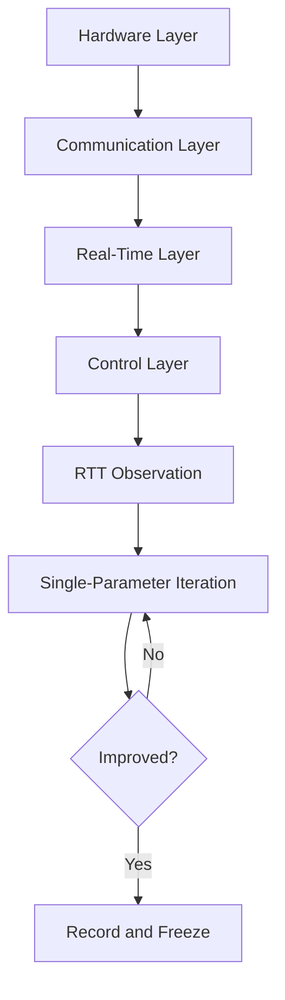

# 08 Debug and Tuning Workflow

## Chapter Goal

Unify troubleshooting and tuning into one executable process:

- localize issue layers before touching gains
- use RTT tooling for evidence-based tuning
- tune in cascade order, not by random trial-and-error

## 1. First Rule: No Layering, No Tuning

In `nyush-rm-control`, issues usually fall into four layers:

1. hardware: power, wiring, mechanical resistance
2. communication: CAN IDs, filters, bus load
3. real-time: task period, blocking, offline behavior
4. control: PID gains, feedforward, feedback source

Only tune layer 4 after layers 1-3 are clean.

## 2. Tuning Tool: How to Use RTT Dashboard

The project already provides a full path (see `nyush-rm-control/docs/rtt-dashboard.md`).

### 2.1 Startup Steps

```bash
make -j12 ROBOT_TYPE=infantry

python3 -m venv .venv
source .venv/bin/activate
pip install -r scripts/requirement.txt

python scripts/dashboard/rtt_dashboard.py
```

To watch logs at the same time:

```bash
python scripts/dashboard/rtt_dashboard.py --mode split --channel 1 --log-channel 0
```

### 2.2 Metrics to Watch During Tuning

Prioritize these fields (already decoded by Dashboard):

- `motor_target_rpm[]` vs `motor_rpm[]`: tracking quality
- `gimbal_*_target_*` vs `gimbal_*_actual_*`: gimbal angle/rate error
- `motor_online_bitmap`, `gimbal_motor_online_bitmap`: device online status
- `can_link_bitmap`: CAN1/CAN2 link health
- `telemetry_drop_count`: MCU-side telemetry drops
- top bar `latency / crc_err / sync_drop`: transport integrity

Training-stage rule of thumb:

- continuously increasing `crc_err`: fix link first, do not tune PID
- continuously increasing `sync_drop`: fix RTT/sampling configuration first
- unstable online bitmaps: check power and communication first

## 3. Standard Loop from Debugging to Tuning

Run every test in this order:

1. fix one input scenario (step/hold/small direction switch)
2. collect baseline without parameter change
3. modify only one gain set at a time
4. evaluate three outputs: overshoot, settling time, steady-state error
5. record conclusion before next iteration

Never change multiple loops in one step.

## 4. Cascade PID Tuning Logic (Code-Aligned)

In `modules/motor/DJImotor/dji_motor.c`, control is cascaded:

- outer loop may be ANGLE
- middle loop may be SPEED
- inner loop may be CURRENT

`DJIMotorControl()` computes in this order: angle -> speed -> current (if enabled).

### 4.1 Correct Tuning Order

1. tune CURRENT first
2. then SPEED
3. then ANGLE

Reason: outer-loop output is inner-loop reference. If the inner loop is unstable, outer-loop tuning is meaningless.

### 4.2 Gain Order Within One Loop

- tune `P` first for responsiveness
- add `D` to reduce oscillation/overshoot
- add `I` last for steady-state error

Use small increments (for example 5%-15%) and keep a rollback record.

## 5. Two High-Frequency Tuning Templates

### 5.1 Chassis Speed Loop (M3508/C620)

Watch: `motor_target_rpm[]` and `motor_rpm[]`

- persistent same-direction error: increase `Kp` first
- overshoot with repeated oscillation: reduce `Kp` or increase `Kd`
- small fixed bias after settling: add a small `Ki`

Prerequisite: stable `motor_online_bitmap` and healthy CAN link.

### 5.2 Gimbal Angle Loop (GM6020)

Use two stages:

1. ensure speed loop is stable first
2. then enable/tune angle loop

Watch `gimbal_yaw_target_deg` vs `actual_deg` (same for pitch):

- slow response: increase angle-loop `Kp`
- oscillation near setpoint: reduce angle-loop `Kp` or improve speed-loop damping
- persistent small offset: add a small `Ki` last

## 6. Common Misdiagnoses and Corrections

- Misdiagnosis 1: jitter means `Kd` issue
  - Correction: check mechanics and sensor noise first

- Misdiagnosis 2: large error means add `Ki` immediately
  - Correction: verify communication and timing stability first

- Misdiagnosis 3: bad waveform means increase sampling rate
  - Correction: check bus load and task budget first

## 7. Tuning Log Template (Reusable)

```text
Target:
Input pattern:
Parameter change:
Key observations (target/feedback, online states, latency/drop):
Result (overshoot/settling/steady-state error):
Conclusion and next step:
```

## 8. Chapter Tasks

- Task A: run RTT Dashboard and capture key metrics
- Task B: complete one single-loop tuning session (at least 3 iterations)
- Task C: submit a tuning report including "why this change"

## 9. Pass Criteria

- you localize layer before tuning
- you can explain cause-effect between gain change and waveform change
- you can reproduce your own tuning result reliably

## Chapter Diagram


