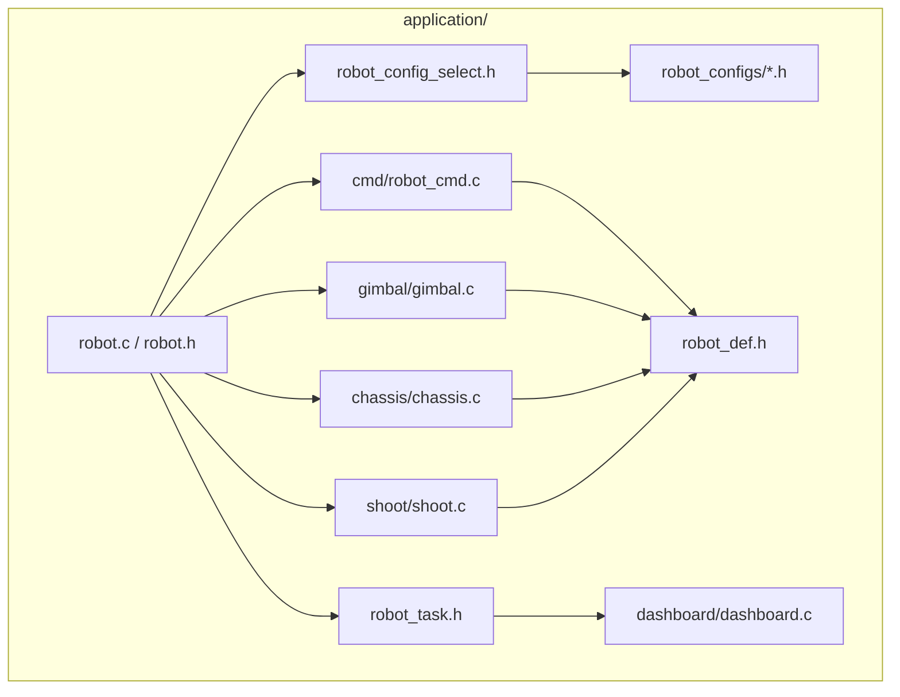
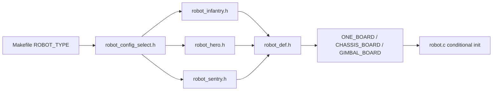
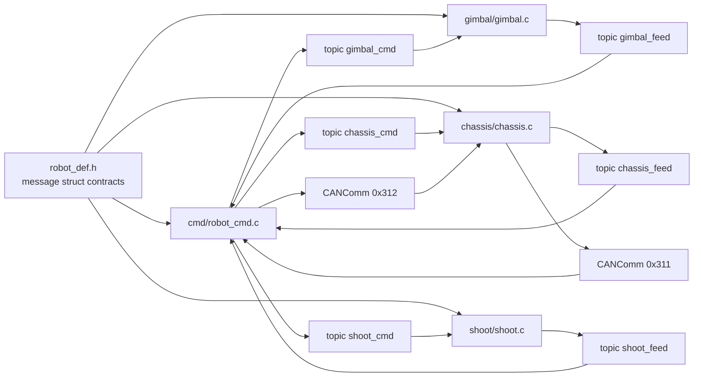

# 07 Application Layer Code Structure

## Chapter Goal

This chapter is about how code is organized, not task timeline flow. After this chapter, you should be able to:

- locate responsibilities of each file under `application`
- explain dependencies among `robot_cmd / gimbal / chassis / shoot`
- distinguish single-board and dual-board differences at application level
- add one new app module with correct file touch points

## 1. Application Layer Boundary: What It Owns

The application layer owns robot behavior orchestration:

- ingest inputs from RC, vision, referee, and inter-board links
- decide operation modes for chassis, gimbal, and shooting
- produce targets for modules (motor refs, communication payloads)

The application layer should not own:

- peripheral driver details (`bsp`)
- generic controller or transport implementations (`modules`)

## 2. Code Structure Overview (File-Level)

Main code locations:

- entry and scheduling: `nyush-rm-control/application/robot.c`, `nyush-rm-control/application/robot_task.h`
- robot config selection: `nyush-rm-control/application/robot_config_select.h`
- data contracts: `nyush-rm-control/application/robot_def.h`
- core apps: `nyush-rm-control/application/cmd/robot_cmd.c`, `nyush-rm-control/application/gimbal/gimbal.c`, `nyush-rm-control/application/chassis/chassis.c`, `nyush-rm-control/application/shoot/shoot.c`

## 3. Build-Time Structure: Decide Robot Identity First

At build time, application structure is decided by:

- robot type selection: `ROBOT_TYPE ?= infantry` in `Makefile`
- board mode selection: `ONE_BOARD / CHASSIS_BOARD / GIMBAL_BOARD`

This determines whether your app path is:

- single-board topic path via `message_center`
- dual-board transport path via `CANComm`

## 4. Startup Structure: `robot.c` Is Assembly-Only

`RobotInit()` follows a fixed structure:

1. disable interrupts
2. run `BSPInit()` and `LEDInit()`
3. initialize app modules by board mode
4. run `OSTaskInit()`
5. re-enable interrupts

Key rule: keep `robot.c` as assembly and dispatch only, not business logic.

## 5. `robot_def.h` Is the Data Contract Hub

`robot_def.h` centralizes:

- mode enums: `chassis_mode_e`, `gimbal_mode_e`, `loader_mode_e`
- command structs: `Chassis_Ctrl_Cmd_s`, `Gimbal_Ctrl_Cmd_s`, `Shoot_Ctrl_Cmd_s`
- feedback structs: `Chassis_Upload_Data_s`, `Gimbal_Upload_Data_s`, `Shoot_Upload_Data_s`

It also uses `#pragma pack(1)` to keep binary layout consistent for inter-board transport.

So when adding a new cross-app field, update `robot_def.h` first, then producer/consumer code.

## 6. Responsibility Split of Core Apps

### 6.1 `robot_cmd.c`: Input Adapter and Global Mode Brain

Responsibilities:

- read RC and vision inputs
- generate chassis/gimbal/shoot command payloads
- publish commands and subscribe feedback
- in dual-board mode, bridge with chassis board via `CANComm` (`0x312 <-> 0x311`)

### 6.2 `gimbal.c`: Gimbal Executor Wrapper

Responsibilities:

- subscribe `gimbal_cmd`
- initialize yaw/pitch motor controllers
- switch feedback source and loop mode by state
- publish `gimbal_feed`

### 6.3 `chassis.c`: Chassis Kinematics and Power Entry

Responsibilities:

- subscribe `chassis_cmd` (or read from `CANCommGet`)
- apply mode-dependent `wz` logic and coordinate mapping
- compute wheel targets and set motor refs
- publish `chassis_feed` (or send by `CANCommSend`)

### 6.4 `shoot.c`: Shooting State Machine

Responsibilities:

- subscribe `shoot_cmd`
- switch loader outer loop and friction wheel behavior by mode
- publish `shoot_feed`

## 7. Communication Structure in Application Layer

Notes:

- single-board: mostly topic-based (`message_center`)
- dual-board: chassis command/feedback move to `CANComm`
- both paths share the same struct contracts from `robot_def.h`

## 8. Minimal Change Checklist for a New App Module

If you add `application/vision_fusion`, use this order:

1. define command/feedback structs in `robot_def.h`
2. implement module `Init()` and `Task()`
3. register init/task calls in `robot.c` by board mode
4. verify runtime frequency fit in `robot_task.h`
5. integrate via `message_center` or `CANComm`, and do not directly access static state from other apps

## 9. Self-Check

- you can point to mode logic, data contract, and task entry directly from the tree
- you can explain single-board vs dual-board as "same contract, different transport"
- you add behavior in `application`, not by leaking business logic into `bsp`
