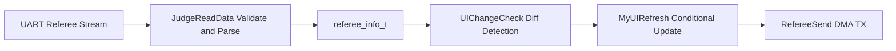

# 09 Referee System and UI Basics

## Chapter Goal

Based on the real `nyush-rm-control` implementation, build a full path that can receive, parse, render, and rate-limit referee/UI traffic.

By the end of this chapter, you should be able to:

- explain the path from UART bytes to business structs
- add one dynamic UI element using existing APIs
- respect UI refresh bandwidth constraints instead of over-refreshing

## 1. Data Path (Code-Aligned)

Core entry is in `modules/referee/referee_task.c`:

- `UITaskInit(&huart6, &ui_data)` calls `RefereeInit()`
- `RefereeInit()` in `modules/referee/rm_referee.c` registers UART callback and daemon
- UART callback `RefereeRxCallback()` calls `JudgeReadData()` to parse frames
- parsed fields are written into `referee_info_t` (`modules/referee/rm_referee.h`)
- application reads the same data via `RefereeGetData()`

## 2. Protocol Parsing Essentials

`JudgeReadData()` performs three checks:

- SOF equals `0xA5`
- header CRC8
- full-frame CRC16

After validation, it dispatches by `CmdID`, for example:

- `0x0201` -> `GameRobotState`
- `0x0202` -> `PowerHeatData`
- `0x0207` -> `ShootData`
- `0x0301` -> student interactive data

So for control constraints, use parsed `referee_info_t` fields directly instead of re-parsing raw bytes.

## 3. Two-Stage UI Model

Current implementation is explicitly split into:

- init stage: `MyUIInit()`
- runtime stage: `UITask()` -> `MyUIRefresh()`

### 3.1 Init Stage (One-Time)

`MyUIInit()` does the following:

- waits until `GameRobotState.robot_id != 0` (valid referee stream)
- computes client ID (`Cilent_ID = 0x0100 + Robot_ID`)
- clears UI with `UIDelete(..., UI_Data_Del_ALL, 0)`
- draws static elements and initial dynamic values

### 3.2 Runtime Stage (Change-Driven)

`UIChangeCheck()` compares current vs last values and sets flags. `MyUIRefresh()` updates only flagged items, then clears flags.

This is the project’s standard "refresh-on-change" pattern.

## 4. UI API Usage Rules (Must Follow)

APIs are in `modules/referee/referee_UI.c/.h`, common functions:

- draw: `UICharDraw`, `UILineDraw`, `UIRectangleDraw`, `UIFloatDraw`
- commit: `UICharRefresh`, `UIGraphRefresh`

Critical rules:

- use `UI_Graph_ADD` at init, `UI_Graph_Change` for updates
- keep `graphic_name` stable for the same element
- text overwrite requires fixed-width alignment (current code pads with spaces)
- `UIGraphRefresh` supports only `1/2/5/7` graph objects per call (see `cnt` branches)

## 5. Rate and Bandwidth: Why You Must Not Spam UI

In `RefereeSend()` (`modules/referee/rm_referee.c`):

- TX is DMA-based
- each send is followed by `osDelay(115)`

This effectively limits UI TX to around 8-10Hz to match link constraints and avoid congestion.

Engineering guidance:

- do not add unnecessary refresh items
- merge updates and send in grouped packets
- prefer event-driven + low-frequency refresh behavior

## 6. Correct Integration with Application Layer

Current integration point is in `application/chassis/chassis.c`:

- `referee_data = UITaskInit(&huart6, &ui_data)`

`ui_data` (`Referee_Interactive_info_t`) is the source for UI state. Your business logic should update fields such as:

- `chassis_mode`
- `gimbal_mode`
- `shoot_mode`
- `friction_mode`
- `lid_mode`
- `Chassis_Power_Data.chassis_power_mx`

Note: `referee_task.c` currently contains `RobotModeTest()` for demo mode switching. Disable or replace it during real integration.

## 7. Recommended Steps to Add One UI Element

1. add static label and initial dynamic value in `MyUIInit()`
2. add current/last/flag fields in `Referee_Interactive_info_t` if needed
3. add change detection in `UIChangeCheck()`
4. add `UI_Graph_Change` update in `MyUIRefresh()`
5. keep packet count/frequency under control

## 8. Common Failure Checks

- UI task exits immediately: verify `init_flag` and whether `UITaskInit` ran
- no UI appears: verify `robot_id` is not stuck at 0
- intermittent data loss: check `[rm_ref] lost referee data` daemon warning
- display corruption: verify unique `graphic_name` and correct `ADD/CHANGE` usage

## 9. Chapter Tasks

- Task A: print and verify key fields from `PowerHeatData` and `GameRobotState`
- Task B: add one dynamic UI field (for example mode or online state)
- Task C: implement change-driven refresh and compare send counts before/after

## 10. Pass Criteria

- you can explain the full path from UART frame to `referee_info_t`
- you can add and stably refresh one UI element in the current framework
- you can justify why UI refresh should not be high-frequency unconditional TX

## Chapter Diagram

