# RoboMaster Learning Path (Step by Step)

If you are new to RoboMaster controls, follow this order and do not skip chapters.

## Learning Sequence

### Stage A: Make It Run (Week 1)

0. [00 Preface](/en/robomaster/00-preface)
1. [01 Getting Started](/en/robomaster/01-start-here)
2. [02 Tools and Environment](/en/robomaster/02-tools-and-env)
3. [03 First Build and Flash](/en/robomaster/03-first-build-flash)

### Stage B: Understand the Core (Week 2-3)

4. [04 Hardware and Safety Basics](/en/robomaster/04-hardware-safety)
5. [05 CAN Basics](/en/robomaster/05-can-intro)

### Stage C: Integration Engineering (Week 4+)

6. [06 Architecture and Task Flow](/en/robomaster/07-app-architecture)
7. [07 Application Layer Code Structure](/en/robomaster/09-application-layer-code-structure)
8. [08 Debug and Tuning Workflow](/en/robomaster/08-debug-workflow)

### Stage D: Competition-Ready Delivery (Week 6+)

9. [09 Referee System and UI Basics](/en/robomaster/12-referee-system-and-ui)

## Reference Appendix

- [Season and Rules](/en/robomaster/season-rules)
- [Hardware Overview](/en/robomaster/hardware-overview)
- [Hardware Manuals PDF](/en/robomaster/hardware-manuals)
- [Git and Development Environment](/en/robomaster/git-env)

## Learning Path Diagram

```mermaid
flowchart LR
  A[00 Preface] --> B[01 Getting Started]
  B --> C[02 Tools and Environment]
  C --> D[03 First Build and Flash]
  D --> E[04 Hardware and Safety Basics]
  E --> F[05 CAN Basics]
  F --> G[06 Architecture and Task Flow]
  G --> H[07 Application Layer Code Structure]
  H --> I[08 Debug and Tuning Workflow]
  I --> J[09 Referee System and UI Basics]
```

