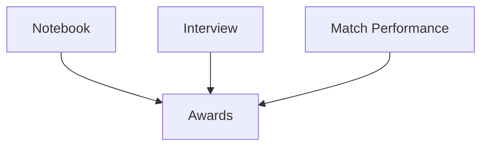

# 01 VEXU Judging Overview

## Chapter Goal

Build a clear map of VEXU judging so your team spends effort on the right outputs.

## 1. Core Judging Inputs

Under VURC Guide to Judging, the two primary judged inputs are:

- Engineering Notebook
- Team Interview

They are complementary:

- notebook provides process evidence
- interview tests student understanding of that process

## 2. Awards That Depend on Notebook

Official `EN7` indicates that Engineering Notebook is required for multiple judged awards (for example Excellence, Design, Innovate, and others listed in-season).

The same section also indicates:

- teams without notebooks should still be offered an initial interview opportunity
- but notebook absence removes eligibility for many judged awards

## 3. Official Position of Team Interview

Official `IN1` defines interview as a timed open discussion with students, not a polished stage presentation.

Key points:

- all teams should have at least one interview opportunity
- teams may decline interview, but that makes them ineligible for most judged awards

## 4. Student-Centered Is a Hard Constraint

The Student-Centered Policy limits mentor behavior:

- no scripted mentor-driven student answers
- no mentor answering/prompting during interviews
- no mentor-authored core notebook content

## 5. What "Judging Success" Actually Means

Not just polished visuals or fluent speaking. Judges look for:

- consistency across notebook, robot behavior, and interview claims
- clear rationale for key design decisions
- evidence that work is student-led

## 6. Chapter Tasks

- list your target judged awards and notebook dependency
- identify weakest current area (notebook vs interview)
- define two improvement goals for next two weeks

## Official Sources

- VURC Guide to Judging: Judged Awards Appendix (revised 2025-08-20): [https://vurc-kb.recf.org/hc/en-us/articles/9653617811735-Guide-to-Judging-Judged-Awards-Appendix](https://vurc-kb.recf.org/hc/en-us/articles/9653617811735-Guide-to-Judging-Judged-Awards-Appendix)
- VURC Guide to Judging: Team Interviews (revised 2025-08-20): [https://vurc-kb.recf.org/hc/en-us/articles/9653402805399-Guide-to-Judging-Team-Interviews](https://vurc-kb.recf.org/hc/en-us/articles/9653402805399-Guide-to-Judging-Team-Interviews)

## Chapter Diagram

