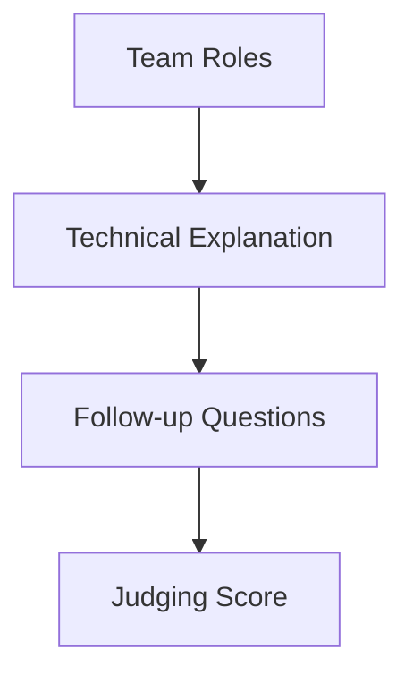

# 03 Team Interview Requirements (Not a Prepared Presentation)

## Chapter Goal

Shift interview preparation from script memorization to evidence-backed, question-driven explanation.

## 1. Interview Is Not a Stage Presentation

Official Team Interviews guidance states:

- interview should remain judge-student dialogue
- it should not become a rehearsed presentation format
- judges evaluate student explanation quality under questions

## 2. What Teams May Bring

Official guidance allows teams to bring:

- robot
- notebook (if available)
- code devices (optional)

The focus remains student interaction, not slide decks or pre-recorded media.

## 3. Time and Structure

Glossary-level guidance commonly uses around 10-15 minutes.

Suggested training structure:

- 2 min: team and robot context
- 6 min: design decisions + iteration evidence
- 4 min: follow-up Q&A and reflection

## 4. What Judges Typically Assess

- real understanding of design choices
- ability to explain failure and tradeoffs
- clarity of communication and authentic role distribution
- student-centered evidence

## 5. Frequent Scoring Losses

- only outcomes, no process evidence
- one student answers everything
- over-scripted responses fail under follow-up questions
- mismatch between notebook claims and spoken claims

## 6. Preparation Methods

### Method A: Question Pool Drills

Prepare by domains:

- mechanical design
- control strategy
- testing and retrospectives
- failure iteration

### Method B: Role Rotation

- rotate primary responder in mock interviews
- ensure each member can explain owned modules

### Method C: Evidence Binding

- tie every major claim back to notebook evidence

## 7. Worlds-Specific Extra Notes

2026 Worlds judging page includes items such as:

- initial judged interviews scheduled remotely
- notebook submitted digitally within required windows
- initial interview should not be treated as rehearsed presentation

Always re-check the current-year page.

## 8. Chapter Tasks

- Task A: run one 12-minute mock interview
- Task B: prepare 20 high-frequency follow-up questions
- Task C: resolve notebook/interview inconsistency list

## Official Sources

- VURC Guide to Judging: Team Interviews (IN1): [https://vurc-kb.recf.org/hc/en-us/articles/9653402805399-Guide-to-Judging-Team-Interviews](https://vurc-kb.recf.org/hc/en-us/articles/9653402805399-Guide-to-Judging-Team-Interviews)
- RECF VEX Worlds Judging Guidelines and Processes (2026): [https://vrc-kb.recf.org/hc/en-us/articles/28173238704535-VEX-Robotics-World-Championship-2026-Judging-Guidelines-and-Processes](https://vrc-kb.recf.org/hc/en-us/articles/28173238704535-VEX-Robotics-World-Championship-2026-Judging-Guidelines-and-Processes)

## Chapter Diagram

