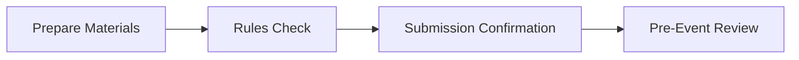

# 04 Submission and Pre-Event Execution Checklist

## Chapter Goal

Translate notebook/interview requirements into schedule and execution controls.

## 1. In-Season Execution Cadence

### Weekly

- complete one primary notebook entry
- update interview question pool

### Bi-weekly

- run one full mock interview
- run one rubric self-review

### Monthly

- run one full-team judging rehearsal

## 2. Two-Week Pre-Event Checklist

- notebook structure complete and navigable
- citation coverage complete
- key decisions supported by test/iteration evidence
- each member can explain owned work

## 3. Three-Day Pre-Event Checklist

- two rounds of timed mock interview
- language consistency checks
- finalize top-10 hard follow-up questions

## 4. Worlds-Specific Checklist Example

Based on 2026 Worlds page, verify:

- initial remote interview slot confirmed
- notebook submitted according to RobotEvents instructions
- submission links accessible with required permissions

## 5. Risk Response Template

### Risk 1: notebook submission failure

- mitigation: complete upload 48h early and validate links twice

### Risk 2: key presenter unavailable

- mitigation: maintain at least two responders per module

### Risk 3: unexpected follow-up questions

- mitigation: answer with validated facts + next-step plan, avoid guessing

## 6. Chapter Tasks

- Task A: create team-specific pre-event calendar
- Task B: run one full submission-chain drill
- Task C: define interview role-rotation schedule

## 7. Pass Criteria

- your team runs by executable schedule, not verbal intent
- your team can execute submission and interview under pressure
- your team resolves risk before competition day

## Official Sources

- RECF VEX Worlds Judging Guidelines and Processes (2026): [https://vrc-kb.recf.org/hc/en-us/articles/28173238704535-VEX-Robotics-World-Championship-2026-Judging-Guidelines-and-Processes](https://vrc-kb.recf.org/hc/en-us/articles/28173238704535-VEX-Robotics-World-Championship-2026-Judging-Guidelines-and-Processes)
- VURC Guide to Judging: Team Interviews: [https://vurc-kb.recf.org/hc/en-us/articles/9653402805399-Guide-to-Judging-Team-Interviews](https://vurc-kb.recf.org/hc/en-us/articles/9653402805399-Guide-to-Judging-Team-Interviews)
- VURC Guide to Judging: Judging Engineering Notebooks: [https://vurc-kb.recf.org/hc/en-us/articles/9653457946135-Guide-to-Judging-Judging-Engineering-Notebooks](https://vurc-kb.recf.org/hc/en-us/articles/9653457946135-Guide-to-Judging-Judging-Engineering-Notebooks)

## Chapter Diagram

