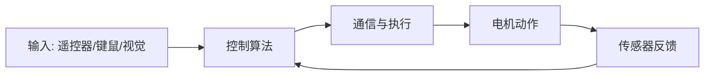

# 00 前言

## 前言

RoboMaster 是一项高度工程化的竞赛。电控、视觉、算法、通信和调试流程需要同时协同，因此技术栈广、学习曲线陡。

对 NYU Shanghai 这样工科课程相对有限的环境来说，想一次性掌握全部电控知识并不现实。本教材的目标是降低入门成本，帮助大家先跑通控制系统最小闭环，再逐步建立完整的嵌入式工程能力。

这份文档最初写于队伍初创阶段。当时技术积累有限、试错样本不足，部分内容可能并不完美。欢迎后续成员持续补充、修订与纠错，把它维护成可传承的队内知识库。

## 技术栈

默认前提：你具备基础计算机能力（包含 ICP、ICDS 的相关基础），并掌握以下通识。

- Git
- Linux 基本操作（Ubuntu）
- 至少一门编程语言的核心思想

### 电控方向核心知识

- 嵌入式开发
- C 语言与编译
- 单片机（MCU）
- 基础控制算法

课程对应上，`Computer Architecture` 与 `Operating System` 中的 C、编译和中断知识会直接用到；`Embedded System` 与电控实践更贴近；`Data Structure` 中的数据结构也会反复出现。硬件相关工作还需要 `Circuit` 的基础。

### 视觉方向核心知识

- 传统计算机视觉
- 神经网络（YOLO）
- 相机内参、外参与标定
- 视觉相关物理知识

在 NYU Shanghai，`Computer Vision` 可作为视觉工作的理论基础，队内视觉开发则是其工程化延伸。

### 哨兵方向核心知识

- SLAM
- 雷达定位算法
- 导航算法

校内暂无完全对应课程，但 Tandon 的 `Localization and Robotics Navigation` 涵盖了相关主题。

## 为什么这些能力仍然重要

在机器学习与自然语言处理快速发展的背景下，传统电控与传统视觉看起来可能“不够热门”。但这里沉淀的工程方法具备很强通用性，往往能在后续项目中持续复用。如果你对机器人系统感兴趣，control system 会提供完整、扎实的实践场景。

## 通用常识

- 正确开关机流程
- 每个硬件部件的功能
- 基础安全规范

## 电控组概述

电控工作的核心目标是：将键盘或遥控器输入转换为电机电流输出，让机器人按预期动作。

实现这个目标通常包括：

- 基于电机反馈构建速度环，保证转速稳定
- 结合 IMU 数据做运动学正逆解算，保证姿态与运动可控
- 在 MCU 平台完成底层工程实现，包括 CAN 通信与 STM32CubeMX 配置

本质上，电控是在复杂系统中追求可预测、可复现的运动行为。

## 认识硬件

电控入门必须从硬件开始。你不一定需要完整的模电数电训练，也不一定要深入电路图分析，但至少要做到：

- 知道关键器件的作用
- 能完成基本接线与排查
- 能正确配置和管理 CAN ID

## Git 与环境

- Git 详细教程请阅读：[/en/robomaster/git-env](/en/robomaster/git-env)
- 开发环境建议：AI 工具链 + VS Code

## 本章图示

