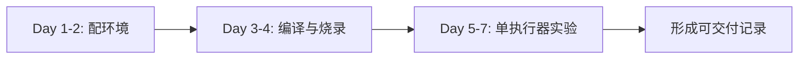

# 01 入门导读

## 本章目标

读完本章，你应该能回答 3 个问题：

1. RoboMaster 电控组到底在做什么。
2. 新成员第一周的“最低合格线”是什么。
3. 为什么队伍要求你先做小实验，而不是直接改整车代码。

## 1. 电控组工作的本质

电控组不是“写几行代码让电机转起来”这么简单。真实工作是：

- 把输入（遥控器/键鼠/视觉）转成稳定控制目标。
- 把控制目标通过通信链路发给执行端。
- 持续读取反馈并修正误差。
- 在故障和异常下让系统可控、可停机、可恢复。

一句话：**做“可预测系统”，而不是“偶尔能动的系统”。**

## 2. 你在队伍里的最小可交付

很多新成员一开始容易陷入“学了很多概念，但没有可运行成果”。

建议把第一个目标定为：

- 能独立完成一次构建与烧录。
- 能解释一个任务循环在做什么。
- 能让一个执行器对命令产生可重复响应。

如果做到这三点，你就已经从“旁观者”进入“可协作开发者”。

## 3. 为什么必须循序渐进

常见失败路径：

- 直接看大段代码，试图一次理解整个系统。
- 直接改参数，没做日志记录。
- 一次同时改多个变量，最后不知道哪一步导致问题。

推荐路径：

- 先跑通最小闭环（编译 -> 烧录 -> 单模块响应）。
- 再理解架构（任务、消息、通信）。
- 最后做性能优化（频率、调参、联调）。

## 4. 新成员第一周行动清单

### Day 1-2

- 配好工具链。
- 拉取仓库并编译通过。

### Day 3-4

- 跑通一种烧录方式（DFU 或调试器）。
- 确认程序可启动并输出可见状态。

### Day 5-7

- 跑一个“单执行器可观测实验”。
- 输出一页实验记录（目标、操作、结果、问题）。

## 5. 术语速览（先不深究）

- `BSP`：底层硬件抽象。
- `Module`：可复用功能模块（电机、算法、消息）。
- `Application`：机器人业务逻辑（底盘、云台、发射）。
- `Closed Loop`：根据反馈持续修正输出。
- `CAN`：电控中常用总线通信方式。

这章只要求“知道大概是什么”，细节会在后续章节补齐。

## 6. 过关标准

本章通过标准：

- 你可以向队友解释“电控组的工作边界”。
- 你知道第一周要交付什么，不再盲目学习。
- 你接受“先小后大”的工程节奏。

## 7. 常见误区

- 误区 1：先把所有代码看懂再动手。
- 误区 2：先追求高性能参数。
- 误区 3：不写记录，全靠记忆排错。

这三条会直接拉低上手效率。

## 本章图示

