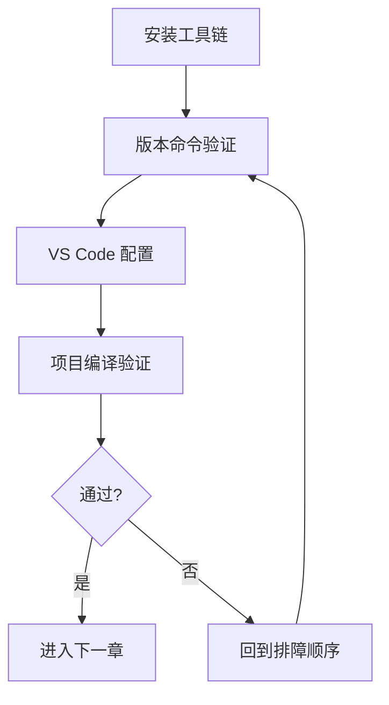

# 01 工具与环境

## 本章目标

基于 `nyush-rm-control` 的实际开发流程，搭建一套“当天可用”的环境：

- 可编译
- 可烧录
- 可调试
- 可协作

本章不追求一次性装全所有工具，而是优先跑通最小闭环。

## 1. 工具链全景（先理解再安装）

核心工具与职责：

- `git`：版本管理与协作
- `arm-none-eabi-gcc`：STM32 交叉编译器
- `make` / `mingw32-make`：构建入口
- `openocd`：调试器通信桥接（ST-Link / DAP-Link）
- `dfu-util`：USB DFU 下载
- `VS Code`：代码编辑、任务管理与断点调试

常用辅助工具：

- `STM32CubeProgrammer`：图形化烧录（新手更直观）
- `STM32CubeMX`：工程外设初始化与代码生成

## 2. 按平台安装（参考 nyush-rm-control）

### macOS

```bash
xcode-select --install
brew install --cask gcc-arm-embedded
brew install openocd dfu-util
```

### Windows（推荐 MSYS2）

在 `MSYS2 MSYS` 终端执行：

```bash
pacman -Syu
# 如提示重启终端，重开后再执行一次
pacman -Syu

pacman -S mingw-w64-x86_64-toolchain \
          mingw-w64-x86_64-arm-none-eabi-toolchain \
          mingw-w64-x86_64-openocd \
          mingw-w64-x86_64-dfu-util \
          git
```

然后把 `C:\msys64\mingw64\bin` 加入系统 `Path`，并重启终端或 VS Code。

### Linux（Ubuntu/Debian）

```bash
sudo apt update
sudo apt install gcc-arm-none-eabi openocd dfu-util build-essential git
```

## 3. 安装后最低验证

依次执行：

```bash
git --version
arm-none-eabi-gcc --version
openocd --version
dfu-util --version
```

判断标准：每条命令都返回版本号，而不是 `command not found`。

## 4. VS Code 最小配置

推荐扩展：

- `C/C++`
- `Cortex-Debug`
- `Cortex-Debug: Device Support Pack - STM32F4`
- `Makefile Tools`

工作区建议（`.vscode/settings.json`）：

```json
{
  "files.eol": "\n",
  "editor.formatOnSave": true,
  "C_Cpp.default.configurationProvider": "ms-vscode.makefile-tools",
  "makefile.configureOnOpen": false
}
```

Windows 额外建议：

```json
{
  "makefile.makePath.windows": "mingw32-make",
  "cortex-debug.armToolchainPath.windows": "C:\\msys64\\mingw64\\bin",
  "cortex-debug.openocdPath.windows": "C:\\msys64\\mingw64\\bin\\openocd.exe"
}
```

## 5. 与项目联动验证（必须做）

在项目根目录执行：

```bash
make ROBOT_TYPE=infantry -j12
```

验证点：

- 构建过程无致命错误
- `build/` 目录出现产物（如 `.elf`、`.bin`）

如果这里失败，不要先改业务代码，先回到环境排查。

## 6. 常见问题与排查顺序

推荐顺序：

1. 先查 `PATH`（是否包含正确工具目录）
2. 再查多版本冲突（系统内是否有多个 `gcc/openocd/make`）
3. 再查终端类型（Windows 下确认你在用 `cmd`、PowerShell 还是 MSYS2）
4. 最后查 VS Code 配置是否命中当前工作区

高频问题：

- Windows 下 `make` 找不到：优先使用 `mingw32-make`
- `dfu-util -l` 无设备：先确认板子是否进入 DFU 模式
- `openocd` 启动失败：优先检查调试器驱动与接口配置

## 7. 本章实操任务

- 任务 A：完成全部版本命令验证并记录输出
- 任务 B：完成一次 `make ROBOT_TYPE=infantry -j12`
- 任务 C：写一份 5-10 行“环境故障排查记录”（现象、原因、处理、结果）

## 8. 过关标准

- 你能在新机器上复现同样环境
- 你知道“先排环境还是先排代码”的判断标准
- 你能指导一位新成员完成从安装到首次编译

## 本章图示



