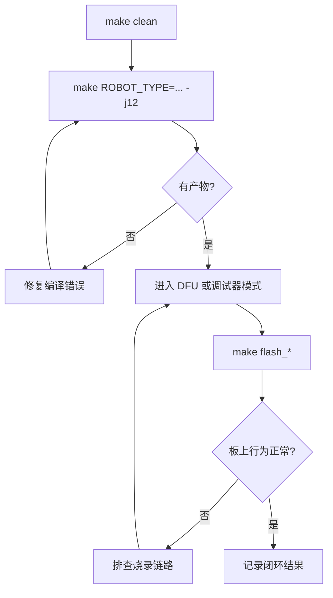

# 02 第一次编译与烧录

## 本章目标

把“仓库代码”稳定变成“板上可运行程序”，并完成第一次可复现的编译与烧录闭环。

你在本章结束时应做到：

- 能独立完成一次完整编译
- 能使用至少一种方式成功烧录
- 能判断问题出在“编译”还是“烧录”

## 1. 开始前检查

先确认以下条件都满足：

- 第 01 章工具链验证通过（`gcc/openocd/dfu-util/make` 可用）
- 目标板供电正常、数据线可传输（非纯充电线）
- 你知道当前目标机器人类型（默认 `infantry`）

## 2. 编译链路与产物认知

最小链路：

```text
源代码 -> 预处理/编译 -> 链接 -> 生成产物 -> 烧录 -> 板上启动
```

常见产物：

- `.elf`：调试和符号信息最完整
- `.hex`：文本格式镜像
- `.bin`：裸二进制镜像（DFU 常用）

## 3. 第一次编译（推荐顺序）

### 步骤 A：清理旧产物

```bash
make clean
```

### 步骤 B：执行并行编译

```bash
make ROBOT_TYPE=infantry -j12
```

你也可以切换类型：

```bash
make ROBOT_TYPE=hero -j12
make ROBOT_TYPE=sentry -j12
```

说明：在 `nyush-rm-control` 中，`ROBOT_TYPE` 默认值就是 `infantry`。不确定时先用它。

### 步骤 C：检查构建结果

确认 `build/` 目录出现目标文件（例如 `.elf`、`.bin`）。如果没有产物，先解决编译问题，再进入烧录。

## 4. 第一次烧录（优先 DFU）

`nyush-rm-control` 默认烧录目标是 `flash_dfu`，推荐新成员先从 DFU 路径开始。

### 步骤 A：让板子进入 DFU 模式

按硬件文档操作 BOOT0 与复位（RST）。

### 步骤 B：确认 DFU 设备被识别

```bash
dfu-util -l
```

如果看到 `0483:df11` 等 STM32 DFU 设备信息，说明连接正常。

### 步骤 C：执行烧录

```bash
make flash_dfu
# 或使用默认目标
make flash
```

### 步骤 D：退出 DFU 并重启

按一次 RST（或断电重启），观察程序是否运行。

## 5. 其他烧录路径（有调试器时）

如果你接了外部调试器，可使用：

```bash
make flash_dap
make flash_stlink
make flash_jlink
```

选择规则：

- 有 DAP-Link：`flash_dap`
- 有 ST-Link：`flash_stlink`
- 有 J-Link：`flash_jlink`

## 6. 如何判断“本次成功”

至少满足两项：

- 命令执行结束且无错误退出
- 板子重启后有预期状态变化（灯、日志、行为）
- 测试输入能触发执行器响应

## 7. 常见失败与定位思路

高频问题：

- `command not found`：环境没配好，回到第 01 章
- 无编译产物：编译阶段失败，不要直接烧录
- `dfu-util -l` 无设备：DFU 模式未进入或线缆/端口异常
- `openocd` 连接失败：调试器驱动或配置不匹配

建议定位顺序：

1. 先确认工具是否可执行
2. 再确认产物是否存在
3. 再确认下载链路（DFU 或调试器）
4. 最后再怀疑业务代码逻辑

## 8. 故障记录模板（建议每人都写）

```text
目标命令：
现象：
已检查项：
处理动作：
结果：
```

## 9. 本章实操任务

- 任务 A：执行一次 `make clean && make ROBOT_TYPE=infantry -j12`
- 任务 B：完成一次 `make flash_dfu`（或你当前可用的其它方式）
- 任务 C：提交一份故障记录（即使这次没有失败，也写“零故障记录”）

## 10. 过关标准

- 你能独立完成编译与烧录闭环
- 你能明确区分“编译错误”和“下载错误”
- 你能指导新成员完成第一次上板

## 本章图示



