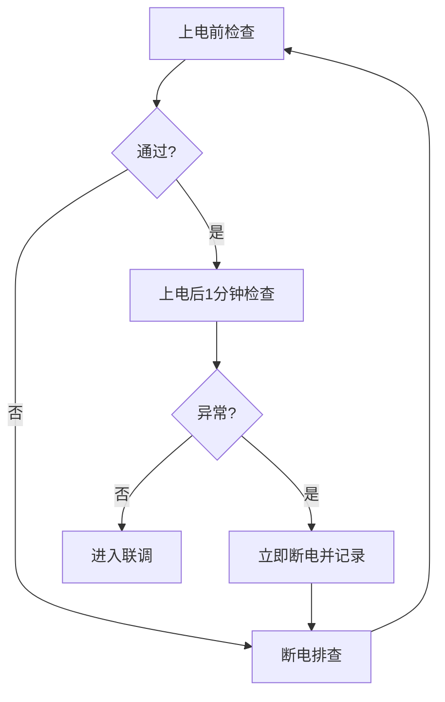

# 03 硬件与安全基础

## 本章目标

建立硬件最小认知和安全操作边界，避免“本来是接线问题，却花两天查软件”的低效情况。

本章完成后，你应能：

- 说清主控、电调、电机、供电、CAN 的职责
- 独立完成一次安全上电检查
- 在 5 分钟内做出“硬件优先还是软件优先”的初步判断

## 1. 先建立系统视角

把机器人电控系统看成 5 条链路：

- 控制链：主控板运行任务和控制算法
- 执行链：电调（ESC）把控制量变为电机驱动
- 感知链：编码器、IMU、限位等反馈回控制器
- 通信链：CAN/UART 传递命令与状态
- 供电链：电池、分电、保护决定系统稳定性

这 5 条链路任何一条异常，都可能表现为“机器人不动”或“乱动”。

## 2. 常见硬件组合（训练优先）

- 底盘常见组合：`M3508 + C620`
- 轻载执行机构：`M2006 + C610`
- 云台常见电机：`GM6020`
- 主控：RoboMaster 开发板 C 型（STM32F4 系列）

说明：具体参数请查阅硬件章节和手册：

- [/zh/robomaster/hardware-overview](/zh/robomaster/hardware-overview)
- [/zh/robomaster/hardware-manuals](/zh/robomaster/hardware-manuals)

## 3. 安全红线（必须遵守）

- 禁止跳过上电前检查直接联调
- 禁止带已知硬件故障继续大电流测试
- 禁止在风险不明时直接提速、提电流
- 禁止把电机/电调直接接到开发板 XT30 口（有反电动势损坏风险）

如果你不确定当前状态是否安全，默认先断电。

## 4. 上电前检查清单（逐项确认）

1. 供电极性正确，电压在器件允许范围内
2. `CAN_H/CAN_L` 未反接，终端连接可靠
3. 电机 ID / 电调 ID / CAN ID 无冲突
4. 所有连接器已压紧，线束无破皮、无松脱
5. 机械结构可自由运动，无明显卡滞
6. 急停策略明确（谁负责断电、谁负责观察）

建议：首次上电把轮子离地或断开高风险执行机构，先做空载验证。

## 5. 上电后第一分钟检查（快速止损）

- 主控板状态灯与预期一致
- 电机在“无命令”时不应自转
- 无异常发热、异味、异响
- 日志无持续离线、总线错误、数据异常跳变

发现异常：立即断电 -> 拍照记录 -> 再排查，不要“边冒烟边试”。

## 6. 新成员高频误判

- 接地不良看起来像“偶发软件 Bug”
- 插头松动看起来像“任务调度不稳定”
- 机械阻力变化看起来像“PID 参数退化”
- CAN ID 冲突看起来像“通信偶现丢包”

结论：先排“供电/接线/ID/机械”，再排代码。

## 7. 快速分层排障法

建议按这个顺序排查：

1. 供电是否稳定
2. 接线是否正确
3. ID 是否冲突
4. 总线是否通
5. 再进入软件日志与控制参数

只要前四步没过，不要急着改控制算法。

## 8. 本章实操任务

- 任务 A：列出当前机器人硬件清单（主控/电调/电机/传感器/供电）
- 任务 B：给每个器件写 1 条“故障症状 -> 首查项”
- 任务 C：完成一次双人交叉上电检查并签字确认

## 9. 过关标准

- 你能独立执行安全上电流程
- 你能在故障初期正确区分硬件层与软件层问题
- 你能把检查过程记录成团队可复用的 Checklist

## 本章图示

