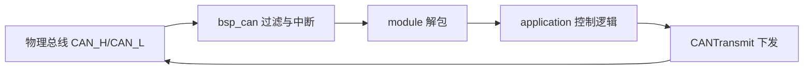

# 04 CAN 通信入门

## 本章目标

这一章会从“能用”走到“看懂框架”：

- 你能解释本项目 CAN 的完整数据路径
- 你能根据代码做 ID 规划，而不是只靠手册记忆
- 你能在出现通信问题时按固定顺序定位到具体层级

## 1. 先建立三层心智模型

在 `nyush-rm-control` 中，CAN 可以按三层理解：

- `bsp` 层：`bsp/can/bsp_can.c` 负责注册、过滤、收发中断分发
- `module` 层：如 `modules/motor/DJImotor/dji_motor.c`、`modules/super_cap/super_cap.c` 负责协议解析
- `application` 层：如 `application/chassis/chassis.c`、`application/cmd/robot_cmd.c` 负责业务控制与板间通信

先分层，再排障，效率会高很多。

## 2. 代码里的 CAN 硬件配置（你要会读）

`Src/can.c` 中 CAN1/CAN2 使用相同参数：

- `Prescaler = 3`
- `BS1 = 10TQ`
- `BS2 = 3TQ`
- `AutoRetransmission = ENABLE`
- `TransmitFifoPriority = ENABLE`

结合 `Src/main.c` 的时钟配置（APB1=42MHz）可得到当前位率约为 `1 Mbps`，与 RoboMaster 常见电机/电调设置一致。

## 3. `bsp_can` 实际工作流

### 3.1 注册阶段

`CANRegister()` 做了几件关键事：

- 首次注册时启动 CAN1/CAN2 并打开 FIFO0/FIFO1 中断通知
- 为每个实例分配过滤器（只接收配置的 `rx_id`）
- 默认发送 `DLC=8`
- 保存模块回调指针，收到匹配报文后触发解析

当前上限：`CAN_MX_REGISTER_CNT = 16`（`bsp/can/bsp_can.h`）。

### 3.2 过滤器与中断分发

实现细节（来自 `CANAddFilter` + `CANFIFOxCallback`）：

- 过滤器 bank `0-13` 给 CAN1，`14-27` 给 CAN2
- 过滤模式使用 `IDLIST`
- 中断回调里按 `can_handle + rx_id` 精确匹配实例，再调用模块回调

这意味着：只要 `rx_id` 规划正确，解析逻辑会非常直接。

### 3.3 发送阶段

`CANTransmit()` 会先等待邮箱空闲，再 `HAL_CAN_AddTxMessage`。

- 如果邮箱持续占满并超过 timeout，会返回失败并打 warning
- 所以 timeout 不宜大于任务周期，否则会拖慢实时任务

## 4. DJI 电机通信在代码里的映射逻辑

核心文件：`modules/motor/DJImotor/dji_motor.c`

### 4.1 一个容易混淆的点

初始化里传入的 `can_init_config.tx_id` 在这里表示“电机 ID（拨码/设置值）”，不是最终发送帧 ID。

### 4.2 框架自动做的事

`MotorSenderGrouping()` 会自动：

- 计算反馈 `rx_id`
  - M2006/M3508：`0x200 + id`
  - GM6020：`0x204 + id`
- 分配发送组（每帧 4 电机）
- 选择最终发送帧 ID：`0x1FF` / `0x200` / `0x2FF`

框架内部准备了 6 个发送器（CAN1 3组 + CAN2 3组），统一在 `DJIMotorControl()` 中批量发送。

### 4.3 ID 冲突保护

注册时会检查同总线 `rx_id` 冲突，冲突会进入错误处理并持续报错。

这也是为什么你应优先改配置头文件，不要在业务代码里硬改 ID。

## 5. 板间通信 `CANComm`：不止 8 字节

核心文件：`modules/can_comm/can_comm.c`

`CANComm` 在 CAN 8 字节限制之上做了分包协议：

- 帧格式：`'s' + len + data + crc8 + 'e'`
- 最大数据：`60` 字节（`CAN_COMM_MAX_BUFFSIZE`）
- 发送端会按 8 字节切片，最后一包自动修改 DLC
- 接收端按状态机组包并做 `crc8` 校验

### 5.1 与业务代码的真实用法

底盘板与云台板通信示例：

- `application/chassis/chassis.c`：`tx_id=0x311, rx_id=0x312`
- `application/cmd/robot_cmd.c`：`tx_id=0x312, rx_id=0x311`

发送/接收长度分别是：

- `sizeof(Chassis_Ctrl_Cmd_s)`
- `sizeof(Chassis_Upload_Data_s)`

这些结构体在 `application/robot_def.h` 中使用了 `#pragma pack(1)`，保证跨板传输不被字节对齐破坏。

### 5.2 在线检测建议

`CANComm` 使用 `Daemon` 做在线检测。建议在 `CANComm_Init_Config_s` 里显式设置 `daemon_count`，按你的 `DaemonTask` 周期计算超时窗口。

## 6. 你的 ID 规划应该落到哪些文件

建议从这些文件统一管理：

- 机器人参数与 ID：`application/robot_configs/robot_infantry.h`（以及 hero/sentry 对应文件）
- 应用层 CANComm 端口：`application/chassis/chassis.c`、`application/cmd/robot_cmd.c`
- 模块层 ID 推导逻辑：`modules/motor/DJImotor/dji_motor.c`

不要把 ID 分散写在多个临时代码片段里。

## 7. 总线负载与控制频率（必须有预算）

已知事实：

- 电机控制任务 `StartMOTORTASK` 以 `osDelay(1)` 运行（约 1kHz）
- `dji_motor.h` 明确提示：单总线挂载过多高频电机会导致拥塞

工程建议：

- 单总线高频电机数尽量控制（训练期建议先不超过 6）
- 若出现丢帧或控制抖动，先降反馈/发送频率再调 PID
- 双 CAN（CAN1/CAN2）要做负载均衡，不要全挂同一条

## 8. 固定排障顺序（代码对照版）

1. 物理层：供电、线序、终端电阻
2. 外设层：`dfu/openocd` 正常后，确认设备确实在线
3. BSP 层：`CANRegister` 是否执行、`rx_id` 是否正确
4. Module 层：回调是否触发、解包字段是否对齐
5. App 层：CANComm 的 `tx/rx` 是否对称、结构体长度是否一致

原则：前一层没过，不进入下一层。

## 9. 本章实操任务

- 任务 A：画出你当前机器人的 CAN 拓扑图（含 CAN1/CAN2、ID、终端电阻位置）
- 任务 B：在代码里追一条电机反馈链路：中断 -> 回调 -> 数据结构
- 任务 C：完成一次板间通信抓虫记录（现象、定位层级、根因、修复）

## 10. 过关标准

- 你能基于代码解释 CAN 报文从“线”到“变量”的完整路径
- 你能独立完成一份无冲突 ID 规划并落地到配置文件
- 你能在 10 分钟内把 CAN 问题缩小到明确层级

## 本章图示

