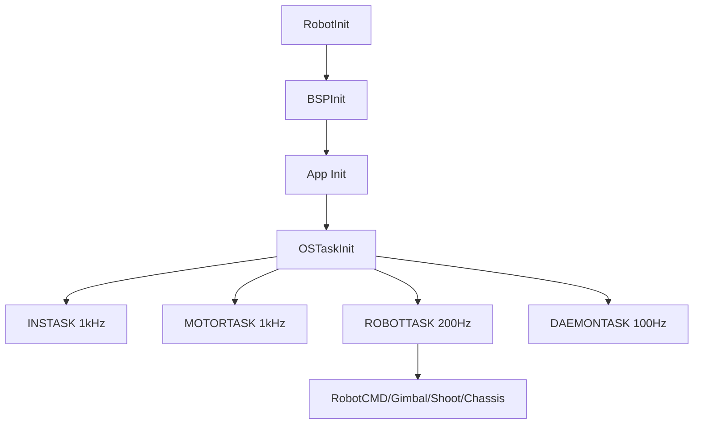

# 05 架构与任务流

## 本章目标

把“目录结构”与“运行时行为”一一对应。读完后你应该能回答：

- 这条控制链路在哪个任务里跑
- 这份数据经过了哪些层
- 改一处配置会影响哪些模块

## 1. 先看编译期：机器人类型如何选中

在 `nyush-rm-control/Makefile` 中，默认配置是：

- `ROBOT_TYPE ?= infantry`

随后在 `application/robot_config_select.h` 中通过 `ROBOT_TYPE_*` 宏选择：

- `robot_infantry.h`
- `robot_hero.h`
- `robot_sentry.h`

这一步决定了板型定义（`ONE_BOARD/CHASSIS_BOARD/GIMBAL_BOARD`）、CAN 总线分配、ID、控制参数等基础行为。

## 2. 再看初始化：系统如何启动

核心入口在 `application/robot.c` 的 `RobotInit()`：

1. 关闭中断（防止初始化阶段被打断）
2. `BSPInit()` 初始化底层外设
3. `LEDInit()`
4. 按板型初始化应用模块：`RobotCMDInit/GimbalInit/ShootInit/ChassisInit`
5. `OSTaskInit()` 创建任务
6. 开启中断

这也是为什么文档一直强调：初始化阶段不要依赖普通中断延时。

## 3. 运行期任务图：谁在什么频率运行

任务创建在 `application/robot_task.h`，关键周期如下：

- `INSTASK`：`osDelay(1)`，约 1kHz
- `MOTORTASK`：`osDelay(1)`，约 1kHz
- `ROBOTTASK`：`osDelay(5)`，约 200Hz
- `DAEMONTASK`：`osDelay(10)`，约 100Hz
- `MONITORTASK`：`osDelay(20)`，约 50Hz
- `UITASK`：循环刷新（内部按发送逻辑节流）

主业务调用链在 `RobotTask()`：

- 云台侧：`RobotCMDTask -> GimbalTask -> ShootTask`
- 底盘侧：`ChassisTask`

## 4. 三层架构在代码里的真实映射

### BSP 层（硬件封装）

- 例：`bsp/can/bsp_can.c`
- 职责：CAN 注册、过滤器配置、中断分发、发送接口

### Modules 层（可复用能力）

- 例：`modules/motor/DJImotor/dji_motor.c`
- 例：`modules/can_comm/can_comm.c`
- 例：`modules/message_center/message_center.c`
- 职责：协议解析、控制计算、跨应用通信机制

### Application 层（机器人行为）

- 例：`application/cmd/robot_cmd.c`
- 例：`application/chassis/chassis.c`
- 职责：模式切换、运动解算、任务编排

## 5. 单板与双板：数据是怎么走的

### 单板（`ONE_BOARD`）

应用间走 `message_center` 的 pub-sub：

- `robot_cmd` 发布 `chassis_cmd/gimbal_cmd/shoot_cmd`
- 其他应用订阅后执行

注意：`modules/message_center/message_center.h` 里 `QUEUE_SIZE = 1`，语义是“保留最新值”，不是完整历史队列。

### 双板（`CHASSIS_BOARD/GIMBAL_BOARD`）

板间走 `CANComm`：

- 底盘板在 `application/chassis/chassis.c` 配置 `tx_id=0x311, rx_id=0x312`
- 云台板在 `application/cmd/robot_cmd.c` 配置 `tx_id=0x312, rx_id=0x311`

双向结构体长度用 `sizeof(...)` 绑定，结构体在 `application/robot_def.h` 下使用 `#pragma pack(1)`，避免跨板对齐错位。

## 6. 一条完整控制链路（按代码）

以底盘速度命令为例：

1. `RobotCMDTask()` 生成 `Chassis_Ctrl_Cmd_s`
2. 单板：发布到 `message_center`；双板：`CANCommSend()` 发给底盘板
3. `ChassisTask()` 取命令后做运动学解算
4. 调用 `DJIMotorSetRef()` 写入电机目标
5. `MOTORTASK` 中的 `DJIMotorControl()` 计算 PID 并分组打包
6. `CANTransmit()` 发送到电调/电机
7. 电机反馈经 CAN 回调解包，刷新测量值

这条链路断在哪一层，就去对应层排。

## 7. 在线监测与故障边界

`Daemon` 机制（`modules/daemon`）用于在线检测：

- 模块收到新数据时 `DaemonReload()`
- 超时后触发离线回调（例如电机掉线告警）

工程上它是“最后一道保底”，不是替代排障流程的捷径。

## 8. 你改代码时的落点建议

- 改机器人参数与 ID：优先改 `application/robot_configs/*.h`
- 改通信协议：优先改 `modules/can_comm` 或对应 module
- 改业务逻辑：优先改 `application/*`
- 不要在 `bsp` 层塞业务逻辑

## 9. 本章实操任务

- 任务 A：画出你当前模式（单板/双板）的任务与数据流图
- 任务 B：跟一条底盘命令，从输入到电机反馈写出路径
- 任务 C：任选一个模块，标注它属于 BSP/Modules/Application 哪一层以及原因

## 10. 过关标准

- 你能用“分层 + 任务周期”解释一个控制问题
- 你能判断一个改动应落在哪个目录
- 你不会再用跨层硬改把系统耦合到一起

## 本章图示

