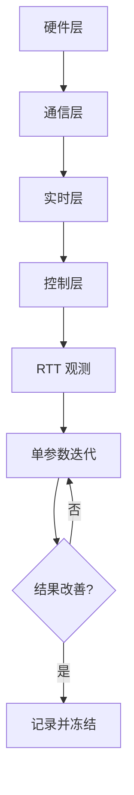

# 07 调试与调参工作流

## 本章目标

把“排障”和“调参”合成一条可执行流程：

- 先定位问题层级，再动参数
- 会用 RTT 调参工具看关键指标
- 按串级控制顺序调参，而不是凭感觉乱试

## 1. 先定规则：不分层，不调参

在 `nyush-rm-control` 里，问题通常分 4 层：

1. 硬件层：供电、接线、机械阻力
2. 通信层：CAN ID、过滤器、总线负载
3. 实时层：任务周期、阻塞、掉线
4. 控制层：PID 参数、前馈、反馈源

只有前 3 层通过，才进入第 4 层调参。

## 2. 调参工具：RTT Dashboard 怎么用

项目已经提供完整链路（见 `nyush-rm-control/docs/rtt-dashboard.md`）。

### 2.1 启动步骤

```bash
make -j12 ROBOT_TYPE=infantry

python3 -m venv .venv
source .venv/bin/activate
pip install -r scripts/requirement.txt

python scripts/dashboard/rtt_dashboard.py
```

需要同时看日志时：

```bash
python scripts/dashboard/rtt_dashboard.py --mode split --channel 1 --log-channel 0
```

### 2.2 调参时重点盯的指标

优先看这些字段（Dashboard 已解析）：

- `motor_target_rpm[]` vs `motor_rpm[]`：目标/反馈跟踪质量
- `gimbal_*_target_*` vs `gimbal_*_actual_*`：云台角度/角速度误差
- `motor_online_bitmap`、`gimbal_motor_online_bitmap`：设备在线状态
- `can_link_bitmap`：CAN1/CAN2 链路状态
- `telemetry_drop_count`：遥测发送丢帧累计
- 顶栏 `latency / crc_err / sync_drop`：链路健康度

经验阈值（训练期）：

- `crc_err` 持续增长：先查链路，不调 PID
- `sync_drop` 持续增长：先查 RTT/采样频率
- 在线位图不稳定：先查供电与通信

## 3. 从调试到调参：标准闭环

每次实验都按这个顺序：

1. 固定输入场景（阶跃/恒值/小幅正反切换）
2. 记录基线数据（不改参数先跑一轮）
3. 只改一组参数（一次只改一个回路）
4. 回看 3 个结果：超调、稳定时间、稳态误差
5. 写结论，再决定下一步

禁止一次改多组参数，否则无法归因。

## 4. 串级 PID 调参思路（对应代码）

`modules/motor/DJImotor/dji_motor.c` 中，电机控制是串级结构：

- 外环可能是角度环（ANGLE）
- 中间可能是速度环（SPEED）
- 内环可能是电流环（CURRENT）

`DJIMotorControl()` 的实际计算顺序是：角度 -> 速度 -> 电流（按启用情况）。

### 4.1 正确调参顺序

1. 先调最内层（CURRENT）
2. 再调 SPEED
3. 最后调 ANGLE

原因：外环输出是内环输入。内环不稳，外环参数没有意义。

### 4.2 单环内参数顺序

- 先调 `P`：让系统“跟得上”
- 再加 `D`：压振荡和超调
- 最后补 `I`：消稳态误差

每次改动建议从小步长开始（例如 5%-15%），并保留上一版参数。

## 5. 两个高频场景的调参模板

### 5.1 底盘速度环（M3508/C620）

先看：`motor_target_rpm[]` 和 `motor_rpm[]`

- 跟不上且误差长期同向：先增 `Kp`
- 过冲后反复摆动：降 `Kp` 或增 `Kd`
- 基本到位但有固定偏差：小幅加 `Ki`

前提：`motor_online_bitmap` 稳定，CAN 链路无异常。

### 5.2 云台角度环（GM6020）

先分两步：

1. 单独看速度环是否稳定
2. 再打开角度环

看 `gimbal_yaw_target_deg` / `actual_deg`（Pitch 同理）：

- 响应慢：先提角度环 `Kp`
- 到位前后抖动：降角度环 `Kp` 或优化速度环阻尼
- 长期小偏差：最后再补一点 `Ki`

## 6. 常见误判与纠正

- 误判 1：电机抖动就一定是 `Kd` 问题
  - 纠正：先查机械阻力和反馈噪声

- 误判 2：跟踪误差大就直接加 `Ki`
  - 纠正：先确认通信与任务周期是否稳定

- 误判 3：波形不好看就继续加采样频率
  - 纠正：先评估总线负载与任务耗时预算

## 7. 记录模板（建议直接复用）

```text
测试对象：
输入模式：
修改参数：
关键观测（目标/反馈、在线状态、延迟/丢帧）：
结果（超调/稳定时间/稳态误差）：
结论与下一步：
```

## 8. 本章实操任务

- 任务 A：跑一次 RTT Dashboard，截图记录关键指标
- 任务 B：完成一个单回路参数迭代（至少 3 轮）
- 任务 C：提交一份调参报告，必须包含“为什么这样改”

## 9. 过关标准

- 你能先定位层级，再进入调参
- 你能解释一次参数修改与波形变化的因果关系
- 你能复现自己的调参结果，而不是“调完就找不回”

## 本章图示


