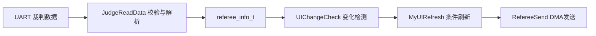

# 08 裁判系统与 UI 入门

## 本章目标

基于 `nyush-rm-control` 的真实代码，建立一条“能接收、能解析、能显示、能限频”的完整链路。

你完成本章后应能：

- 说明裁判系统数据从串口到业务结构体的路径
- 用现有 UI 接口新增一个动态元素
- 理解 UI 刷新频率和带宽约束，不做无意义刷屏

## 1. 数据链路（按代码看）

核心入口在 `modules/referee/referee_task.c`：

- `UITaskInit(&huart6, &ui_data)` 调用 `RefereeInit()` 初始化裁判串口
- `RefereeInit()` 在 `modules/referee/rm_referee.c` 中注册串口回调和守护
- 串口回调 `RefereeRxCallback()` 收到数据后调用 `JudgeReadData()` 解析帧
- 解析结果写入 `referee_info_t`（`modules/referee/rm_referee.h`）
- 业务层通过 `RefereeGetData()` 读取同一份数据

## 2. 协议解析要点

`JudgeReadData()` 做了 3 层校验：

- SOF 是否为 `0xA5`
- 帧头 CRC8
- 整帧 CRC16

通过后按 `CmdID` 分发到不同结构体字段，例如：

- `0x0201` -> `GameRobotState`
- `0x0202` -> `PowerHeatData`
- `0x0207` -> `ShootData`
- `0x0301` -> 学生交互数据

这意味着你做控制约束时，优先从 `referee_info_t` 已解析字段取值，不要重复解析原始字节。

## 3. UI 绘制的两阶段模型

当前实现清晰分成两段：

- 初始化阶段：`MyUIInit()`
- 运行刷新阶段：`UITask()` -> `MyUIRefresh()`

### 3.1 初始化阶段（只做一次）

`MyUIInit()` 会：

- 等待 `GameRobotState.robot_id != 0`（说明已收到有效裁判数据）
- 计算客户端 ID（`Cilent_ID = 0x0100 + Robot_ID`）
- 先 `UIDelete(..., UI_Data_Del_ALL, 0)` 清屏
- 绘制静态元素与动态元素初值

### 3.2 刷新阶段（按变化触发）

`UIChangeCheck()` 比较“当前值 vs 上次值”，置位 flag。`MyUIRefresh()` 只刷新被置位的项，再清 flag。

这是当前工程里“值变化才刷新”的标准实现。

## 4. UI 接口使用规范（必须遵守）

接口在 `modules/referee/referee_UI.c/.h`，常用函数：

- 绘制：`UICharDraw`、`UILineDraw`、`UIRectangleDraw`、`UIFloatDraw`
- 刷新：`UICharRefresh`、`UIGraphRefresh`

关键规则：

- 初始化用 `UI_Graph_ADD`，后续更新用 `UI_Graph_Change`
- 同一元素 `graphic_name` 必须稳定，不要每次改名
- 文本覆盖要注意等宽长度（当前代码中已通过补空格处理）
- `UIGraphRefresh` 仅支持 `1/2/5/7` 个图形打包发送（代码里按 `cnt` 分支）

## 5. 频率与带宽：为什么不能狂刷 UI

`RefereeSend()`（`modules/referee/rm_referee.c`）内部：

- 用 DMA 发送串口数据
- 发送后 `osDelay(115)`

这相当于主动限速到约 8-10Hz 级别，目的是满足裁判链路约束并避免拥塞。

工程建议：

- 非必要不增加刷新项
- 先合并变化，再成组发送
- 尽量把 UI 设计成“事件触发 + 低频刷新”

## 6. 与业务层的正确连接方式

当前接线点在 `application/chassis/chassis.c`：

- `referee_data = UITaskInit(&huart6, &ui_data)`

`ui_data`（类型 `Referee_Interactive_info_t`）是 UI 的输入源。你应该在业务逻辑里更新它的字段，例如：

- `chassis_mode`
- `gimbal_mode`
- `shoot_mode`
- `friction_mode`
- `lid_mode`
- `Chassis_Power_Data.chassis_power_mx`

注意：当前 `referee_task.c` 里有 `RobotModeTest()` 测试函数，会周期性改写这些模式。正式联调时应关闭或替换为真实业务数据。

## 7. 新增一个 UI 元素的推荐步骤

1. 在 `MyUIInit()` 增加静态标签和动态初值
2. 在 `Referee_Interactive_info_t` 增加当前值/上次值/flag（如需要）
3. 在 `UIChangeCheck()` 增加变化检测
4. 在 `MyUIRefresh()` 增加 `UI_Graph_Change` 刷新逻辑
5. 控制发送频率，优先合包

## 8. 常见故障排查

- UI 任务启动后立刻退出：检查 `init_flag` 和 `UITaskInit` 是否执行
- UI 一直不显示：检查 `robot_id` 是否长期为 0（串口未收到有效帧）
- 数据偶发断流：关注日志 `[rm_ref] lost referee data`（daemon 触发）
- 显示错乱：检查 `graphic_name` 是否冲突、`ADD/CHANGE` 是否混用

## 9. 本章实操任务

- 任务 A：打印并验证 `PowerHeatData` 与 `GameRobotState` 的关键字段
- 任务 B：新增一个动态 UI 字段（比如底盘模式或在线状态）
- 任务 C：实现“变化触发刷新”，并记录刷新前后发送次数

## 10. 过关标准

- 你能准确说明裁判数据从 UART 到 `referee_info_t` 的路径
- 你能按现有框架新增并稳定刷新一个 UI 元素
- 你能解释为什么当前 UI 刷新不能做成高频无条件发送

## 本章图示

