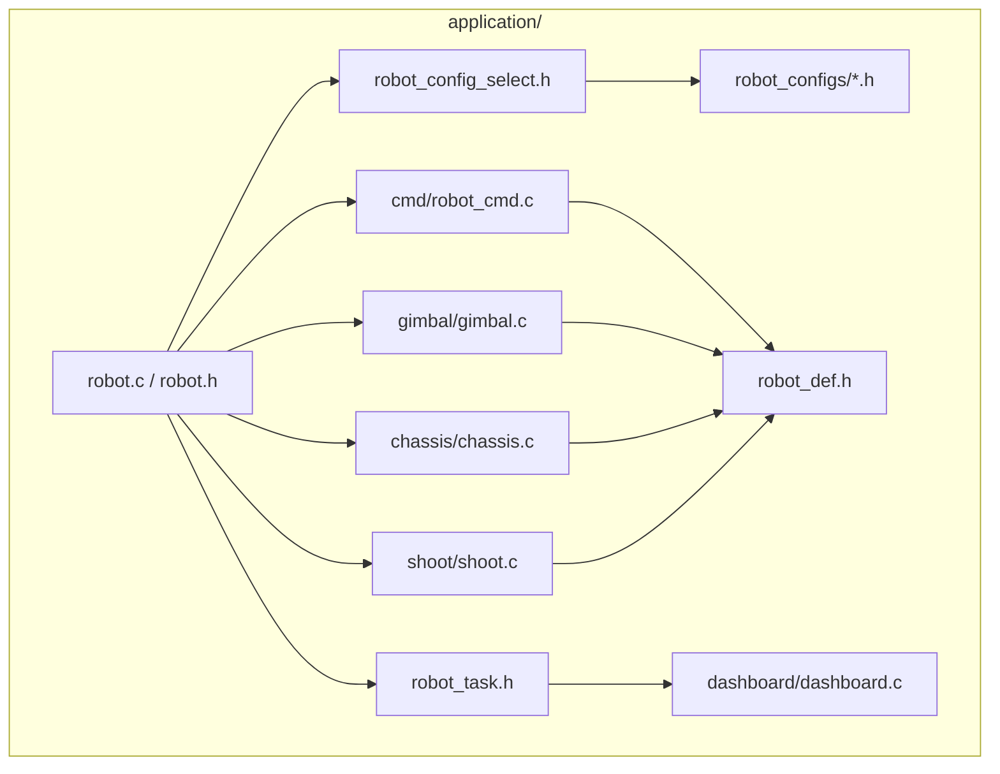
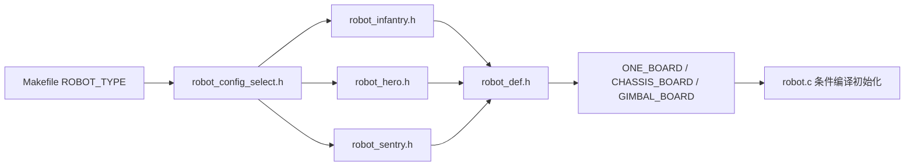
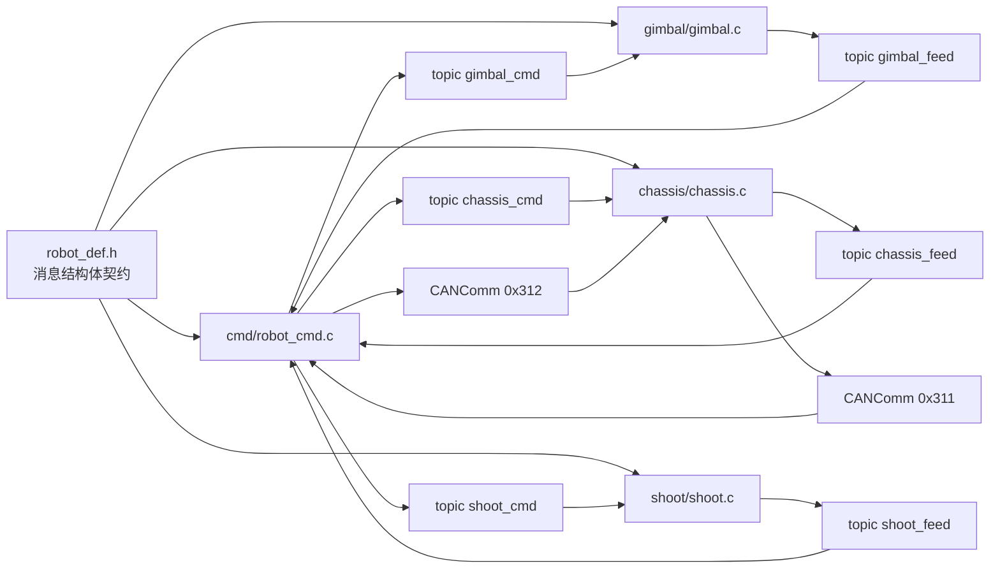

# 07 Application 层代码结构

## 本章目标

这章不讲“任务怎么跑”，只讲“代码怎么组织”。读完后你应该能：

- 快速定位 `application` 层每个文件的职责
- 解释 `robot_cmd / gimbal / chassis / shoot` 的依赖关系
- 区分单板与双板在 `application` 层的代码差异
- 新增一个应用模块时，知道应该改哪些文件、不能改哪些文件

## 1. `application` 层边界：它负责什么，不负责什么

`application` 层负责“机器人行为编排”，核心是：

- 接输入：遥控器、视觉、裁判系统、板间数据
- 定模式：底盘模式、云台模式、发射模式
- 出目标：给 module 层的电机/通信模块设置参考值或发送结构体

`application` 层**不**负责：

- 外设驱动细节（那是 `bsp`）
- 通用控制器与通用通信实现（那是 `modules`）

## 2. 代码结构总览（文件级）

对应代码位置：

- 入口与调度：`nyush-rm-control/application/robot.c`、`nyush-rm-control/application/robot_task.h`
- 机器人配置选择：`nyush-rm-control/application/robot_config_select.h`
- 数据契约：`nyush-rm-control/application/robot_def.h`
- 四个主应用：`nyush-rm-control/application/cmd/robot_cmd.c`、`nyush-rm-control/application/gimbal/gimbal.c`、`nyush-rm-control/application/chassis/chassis.c`、`nyush-rm-control/application/shoot/shoot.c`

## 3. 编译期结构：先决定“我是谁”

`application` 层在编译期先做两件事：

- 机器人类型选择：`Makefile` 的 `ROBOT_TYPE ?= infantry`
- 板型选择：`ONE_BOARD / CHASSIS_BOARD / GIMBAL_BOARD`

这一步决定了后续是否创建：

- 单板 `message_center` 路径
- 双板 `CANComm` 路径

## 4. 启动结构：`robot.c` 只做编排，不做业务

在 `RobotInit()` 里，结构是固定的：

1. 关中断
2. `BSPInit()` 与 `LEDInit()`
3. 按板型初始化应用模块
4. `OSTaskInit()` 创建任务
5. 开中断

关键点：`robot.c` 只做“装配和调度”，具体控制逻辑不应该塞到这里。

## 5. `robot_def.h` 是 Application 层的数据契约中心

`robot_def.h` 集中定义了：

- 模式枚举：`chassis_mode_e`、`gimbal_mode_e`、`loader_mode_e` 等
- 控制命令结构体：`Chassis_Ctrl_Cmd_s`、`Gimbal_Ctrl_Cmd_s`、`Shoot_Ctrl_Cmd_s`
- 反馈结构体：`Chassis_Upload_Data_s`、`Gimbal_Upload_Data_s`、`Shoot_Upload_Data_s`

并且使用了 `#pragma pack(1)`，用于跨板通信时结构体字节布局一致。

这意味着：如果你要新增一个应用间字段，优先在 `robot_def.h` 改契约，再改生产者/消费者。

## 6. 四个核心应用的结构分工

### 6.1 `robot_cmd.c`：输入适配 + 全局模式机

职责：

- 获取遥控器与视觉输入
- 生成底盘/云台/发射三个控制命令
- 发布命令并订阅各应用反馈
- 双板模式下负责与底盘板 `CANComm` 交互（`0x312 <-> 0x311`）

### 6.2 `gimbal.c`：云台执行器封装

职责：

- 订阅 `gimbal_cmd`
- 初始化 yaw/pitch 电机控制器
- 根据模式切换反馈源和闭环类型
- 发布 `gimbal_feed`

### 6.3 `chassis.c`：底盘运动学与功率约束入口

职责：

- 订阅 `chassis_cmd`（或双板 `CANCommGet`）
- 做底盘模式下的 `wz` 逻辑与坐标映射
- 计算轮速参考并下发电机
- 发布 `chassis_feed`（或双板 `CANCommSend`）

### 6.4 `shoot.c`：发射状态机

职责：

- 订阅 `shoot_cmd`
- 按模式切换拨盘外环（角度/速度）与摩擦轮状态
- 发布 `shoot_feed`

## 7. Application 层通信结构（不是流程图）

说明：

- 单板时，主要走 topic（`message_center`）
- 双板时，底盘相关命令/反馈改走 `CANComm`
- `robot_def.h` 是两条路径共享的结构体契约

## 8. 新增 Application 模块的最小改动清单

如果你要新增一个 `application/vision_fusion` 模块，建议按下面顺序：

1. 在 `robot_def.h` 定义命令/反馈结构体
2. 在新模块里实现 `Init()` 与 `Task()`
3. 在 `robot.c` 中按板型加入初始化与任务调用
4. 在 `robot_task.h` 确认运行频率是否合适
5. 用 `message_center` 或 `CANComm` 接入，不要跨文件直接读写别的应用静态变量

## 9. 本章自检

- 你能从目录树快速指到“模式逻辑在哪儿、结构体契约在哪儿、任务入口在哪儿”
- 你能解释单板与双板在 Application 层的差异是“同一契约，不同传输”
- 你知道新增功能时该改 `application`，而不是把业务塞进 `bsp`
