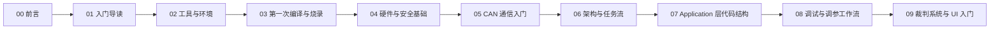

# RoboMaster 学习路径（循序渐进）

如果你是第一次接触 RoboMaster 电控，建议严格按下面顺序学习，不要跳章。

## 学习顺序

### 阶段 A：先跑起来（第 1 周）

0. [00 前言](/zh/robomaster/00-preface)
1. [01 入门导读](/zh/robomaster/01-start-here)
2. [02 工具与环境](/zh/robomaster/02-tools-and-env)
3. [03 第一次编译与烧录](/zh/robomaster/03-first-build-flash)

### 阶段 B：理解核心（第 2-3 周）

4. [04 硬件与安全基础](/zh/robomaster/04-hardware-safety)
5. [05 CAN 通信入门](/zh/robomaster/05-can-intro)

### 阶段 C：工程化联调（第 4 周起）

6. [06 架构与任务流](/zh/robomaster/07-app-architecture)
7. [07 Application 层代码结构](/zh/robomaster/09-application-layer-code-structure)
8. [08 调试与调参工作流](/zh/robomaster/08-debug-workflow)

### 阶段 D：赛季交付能力（第 6 周起）

9. [09 裁判系统与 UI 入门](/zh/robomaster/12-referee-system-and-ui)

## 参考附录

- [赛季与规则](/zh/robomaster/season-rules)
- [硬件概览](/zh/robomaster/hardware-overview)
- [硬件手册 PDF](/zh/robomaster/hardware-manuals)
- [Git 与开发环境](/zh/robomaster/git-env)

## 学习路径图

