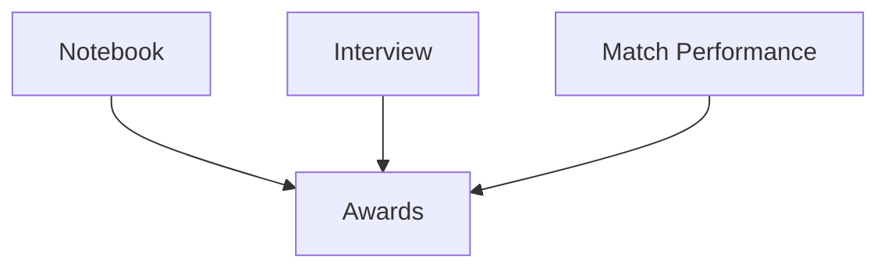

# 01 VEXU 评审总览

## 本章目标

建立 VEXU 评审的“规则地图”，避免把精力花在错误方向。

## 1. 评审由哪些部分构成

按官方 Guide to Judging（VURC）体系，核心由两块组成：

- Engineering Notebook
- Team Interview

两者不是二选一，而是互相印证：

- notebook 展示过程证据
- interview 展示团队对过程的理解与表达

## 2. 哪些奖项强依赖 notebook

官方 `EN7` 明确：Engineering Notebook 是多个 judged awards 的必要条件之一（例如 Excellence、Design、Innovate 等）。

同时官方也强调：

- **没有 notebook 也应有机会参加初始 interview**
- 但没有 notebook 时，很多奖项将无法竞争

## 3. Team Interview 的官方定位

官方 `IN1` 明确：interview 是 judges 与学生的限时开放问答，不是“准备好的舞台演讲”。

关键信息：

- 所有队伍都应有至少一次 interview 机会
- 队伍可以拒绝 interview，但会失去大多数 judged award 资格

## 4. Student-Centered 是硬约束

官方 Student-Centered Policy 对 mentor 行为有明确边界：

- 不允许 mentor 给学生背诵脚本
- 不允许 mentor 在 interview 中代答或提示
- 不允许 mentor 主导 notebook 内容

## 5. 你该怎么理解“评审成功”

不是 notebook 漂亮、讲解流利就行，而是：

- notebook、机器人、interview 三者一致
- 能解释关键设计决策“为什么这样做”
- 能证明工作主要由学生完成

## 6. 本章实操任务

- 列出你目标奖项，并标注是否要求 notebook。
- 列出你队伍当前 notebook 与 interview 的最弱环节。
- 写出 2 周改进目标（各 2 条）。

## 官方来源

- VURC Guide to Judging: Judged Awards Appendix（2025-08-20 修订）：[https://vurc-kb.recf.org/hc/en-us/articles/9653617811735-Guide-to-Judging-Judged-Awards-Appendix](https://vurc-kb.recf.org/hc/en-us/articles/9653617811735-Guide-to-Judging-Judged-Awards-Appendix)
- VURC Guide to Judging: Team Interviews（2025-08-20 修订）：[https://vurc-kb.recf.org/hc/en-us/articles/9653402805399-Guide-to-Judging-Team-Interviews](https://vurc-kb.recf.org/hc/en-us/articles/9653402805399-Guide-to-Judging-Team-Interviews)

## 本章图示

