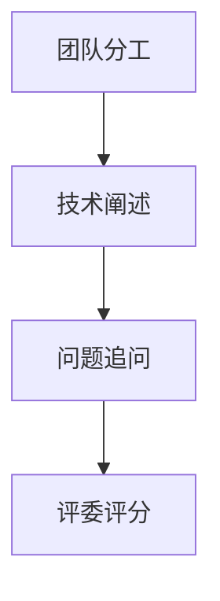

# 03 Team Interview（非 Presentation）要求

## 本章目标

把 interview 训练从“背稿”改成“可追问、可解释、可证明”。

## 1. interview 不是演讲展示

官方 Team Interviews 文档明确：

- interview 应保持问答对话形式
- 不应演变成排练式 presentation
- judges 关注学生如何解释设计与决策

## 2. 现场允许带什么

官方允许团队在 interview 里展示：

- 机器人
- notebook（如果可用）
- 代码设备（可选）

但 judges 重点是与学生对话，而不是看幻灯片或预录内容。

## 3. 时间与组织

官方术语页给出的典型 interview 时长为约 10-15 分钟。

你们训练建议：

- 2 分钟：队伍与机器人定位
- 6 分钟：关键设计决策与迭代证据
- 4 分钟：追问应答与反思

## 4. judges 常看哪些能力

- 团队是否真的理解自己的设计
- 是否能解释失败和权衡
- 沟通是否清晰、分工是否真实
- student-centered 是否成立

## 5. 常见失分点

- 只讲结果，不讲过程证据
- 所有回答集中在一名同学
- 过度背稿，被追问即断
- notebook 与口头叙述不一致

## 6. 高质量准备方法

### 方法 A：问题池演练

按模块准备问题：

- 结构设计
- 控制策略
- 测试与复盘
- 失败迭代

### 方法 B：角色轮换

- 每次模拟让不同同学主答
- 确保每人都能解释自己负责部分

### 方法 C：证据绑定

- 每个关键结论都能指回 notebook 记录

## 7. 世界赛场景的附加要求（需单独关注）

RECF 世界赛页面（2026）给出的关键点包括：

- judged awards 相关初始 interview 为远程安排
- notebook 需按规定时间窗口数字提交
- 初始 interview 不应是排练式 presentation

世界赛前必须复核当年页面细则。

## 8. 本章实操任务

- 任务 A：做一次 12 分钟模拟 interview 并录要点。
- 任务 B：整理 20 个高频追问及回答证据。
- 任务 C：修复“口头说法与 notebook 不一致”的条目。

## 官方来源

- VURC Guide to Judging: Team Interviews（IN1）：[https://vurc-kb.recf.org/hc/en-us/articles/9653402805399-Guide-to-Judging-Team-Interviews](https://vurc-kb.recf.org/hc/en-us/articles/9653402805399-Guide-to-Judging-Team-Interviews)
- RECF VEX Worlds Judging Guidelines and Processes（2026）：[https://vrc-kb.recf.org/hc/en-us/articles/28173238704535-VEX-Robotics-World-Championship-2026-Judging-Guidelines-and-Processes](https://vrc-kb.recf.org/hc/en-us/articles/28173238704535-VEX-Robotics-World-Championship-2026-Judging-Guidelines-and-Processes)

## 本章图示

