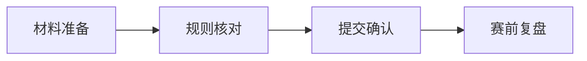

# 04 提交与赛前执行清单

## 本章目标

把 notebook 与 interview 的要求落到日程和清单上，避免“知道要求但临场崩溃”。

## 1. 赛季内常规执行节奏

### 每周

- 完成 notebook 主记录
- 更新问题池（新增问题与答案）

### 每两周

- 做一次完整模拟 interview
- 对照 rubric 做一次自评

### 每月

- 做一次全队评审演练（含追问）

## 2. 赛前两周清单

- notebook 结构完整、目录可用
- 引用与来源标注齐全
- 关键决策有数据与迭代证据
- 每位成员可解释自己负责内容

## 3. 赛前三天清单

- 按评审时长做两轮模拟
- 检查语言一致性（中/英）
- 准备“最容易被追问”的 10 个问题

## 4. 世界赛特别清单（示例）

根据 2026 世界赛页面，需特别确认：

- 初始 remote interview 时间是否已预约
- notebook 是否按 RobotEvents 要求提交
- 提交链接是否无需额外权限可访问

## 5. 风险应对模板

### 风险 1：notebook 提交失败

- 预案：提前 48 小时完成上传并二次验链

### 风险 2：主讲成员临时缺席

- 预案：每个模块至少两人可答

### 风险 3：追问超出准备范围

- 预案：坚持“已验证事实 + 下一步计划”，避免猜测

## 6. 本章实操任务

- 任务 A：生成你们队的赛前两周日历。
- 任务 B：做一次“提交链路演练”（从上传到访问验证）。
- 任务 C：定义你们队的 interview 值班轮换表。

## 7. 过关标准

- 你们有可执行时间表而非口头计划。
- 你们能在压力下完成提交与 interview。
- 你们能把风险前移处理，而不是赛场救火。

## 官方来源

- RECF VEX Worlds Judging Guidelines and Processes（2026）：[https://vrc-kb.recf.org/hc/en-us/articles/28173238704535-VEX-Robotics-World-Championship-2026-Judging-Guidelines-and-Processes](https://vrc-kb.recf.org/hc/en-us/articles/28173238704535-VEX-Robotics-World-Championship-2026-Judging-Guidelines-and-Processes)
- VURC Guide to Judging: Team Interviews：[https://vurc-kb.recf.org/hc/en-us/articles/9653402805399-Guide-to-Judging-Team-Interviews](https://vurc-kb.recf.org/hc/en-us/articles/9653402805399-Guide-to-Judging-Team-Interviews)
- VURC Guide to Judging: Judging Engineering Notebooks：[https://vurc-kb.recf.org/hc/en-us/articles/9653457946135-Guide-to-Judging-Judging-Engineering-Notebooks](https://vurc-kb.recf.org/hc/en-us/articles/9653457946135-Guide-to-Judging-Judging-Engineering-Notebooks)

## 本章图示

