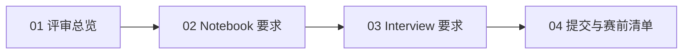

# VEXU 评审与文档实战路径

本章节聚焦你最关心的两件事：

1. Engineering Notebook 到底怎么写才符合官方要求。
2. Team Interview 到底怎么准备，和“做 PPT 演讲”有什么区别。

## 建议阅读顺序

1. [01 VEXU 评审总览](/zh/vex/01-vexu-judging-overview)
2. [02 Engineering Notebook 官方要求](/zh/vex/02-engineering-notebook-requirements)
3. [03 Team Interview（非 Presentation）要求](/zh/vex/03-team-interview-requirements)
4. [04 提交与赛前执行清单](/zh/vex/04-submission-and-prep-checklist)

## 你会得到什么

- 一份可直接执行的 notebook 写作标准
- 一份可直接训练的 interview 准备清单
- 一份赛前提交与时间节点检查表

## 路径图

